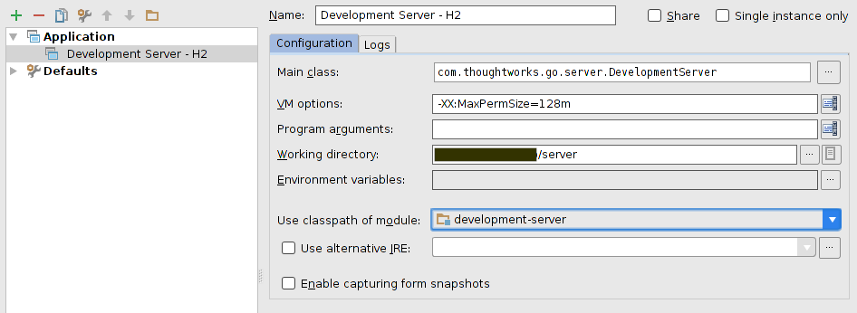
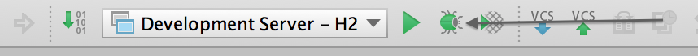

# 3.1 Setting up your development environment 

## 3.1.1 Using vagrant to bring up the Go Development environment

> Supported versions: Vagrant **1.4.3+**, VirtualBox **4.3.6+**

Clone the repository holding the vagrant scripts from 

```
~/projects$ git clone https://github.com/GoCD/go-development-environment-setup.git
~/projects$ cd go-development-environment-setup
```

### Setting up a minimal Go Development Environment (Linux/Mac) -

```
~/projects/go-development-environment-setup$ ./setup.sh
```

### Setting up a minimal Go Development Environment (Windows) -

```
C:/projects/go-development-environment-setup$ setup.bat
```

After running of above setup script finishes, you should automatically get logged into the ubuntu virtual machine (using Virtualbox) environment and give you a shell with code checkout out into /home/vagrant/cruise directory.  

Verify that the setup happened correctly, by navigating into cruise/target/go-server-**version**. In case of Go 14.1.0, 

```
cd cruise/target/go-server-14.1.0
```

Change permissions for server.sh file and run Go server:

```
vagrant@precise64:~/cruise/target/go-server-14.1.0$ chmod +x server.sh
vagrant@precise64:~/cruise/target/go-server-14.1.0$ ./server.sh
```

Access Go server from host machine by accessing the application at **http://localhost:8153** which should bring up the Go dashboard.

> Note: At times due to port collision the Go server might be forwarded to a different port. You should be able to find information about it in the console itself. 

### Setting up a Gnome based Go Development Environment

```
~/projects/go-development-environment-setup$ ./setup.gui.sh
```


### Setting up a minimal Go Development Environment (Windows) -

```
C:/projects/go-development-environment-setup$ setup.gui.bat
```

<TBD> -> We need to simplify the way dev server starts up


###Subsequent Runs

The above is just one time setup. Once the VM is provisioned for subsequent runs, you can bring up the box by running

```
~/projects/go-development-environment-setup$ vagrant up
```

> Note: Network IO might be slow when configured to use NAT (default). You could change it to 'Bridged' mode to improve performance. In this mode, it necessitates that a network interface is chosen upon boot. Add the line below in the Vagrantfile to enable 'Bridged' mode:
>
>```
>config.vm.network :public_network
>```

### Virtual machines credentials

```
Username: vagrant
Password: vagrant

```

## 3.1.2 Setting it up manually

Go requires the following software packages to build

-   JDK 6+ (OpenJDK or Oracle)
-   Ruby (1.8+)
-   Ruby sass gem (3.2.5+)
-   Git (1.7+)
-   Maven (3.1.1+)

Assuming the codebase is cloned into **~/projects/go**, you need to execute the
following commands to build Go

```
~/projects/go$ unset GEM_HOME
~/projects/go$ unset GEM_PATH
~/projects/go$ ./tools/jruby/bin/jruby -J-Xmx2048m -S buildr cruise:prepare ALLOW_NON_PRODUCTION_CODE=yes
```

The above set of commands are captured as part of an executable file named
"**bn**" at the root of the project. In order to achieve the output same as the
above set of commands, you could optionally choose to run

```
~/projects/go$ ./bn cruise:prepare ALLOW_NON_PRODUCTION_CODE=yes
```

After a successful build, the build artifacts are generated inside a directory
named "**target**" in the working directory. The output directory contains JARs
along with the packaged ZIP installer for Go Server and Go Agent.

```
~/projects/go$ ls target
agent
agent-bootstrapper
...
go-agent-14.1.0
go-server-14.1.0
...
util

```

## 3.1.3 Building via IntelliJ IDEA

If you have IntelliJ IDEA configured, you could optionally use it to build Go. 

Prior to build via the IDE, we would have to prepare the working directory with copying the database deltas to the configured location. You can achive this by runnning the below command in the working directory.

```
~/projects/go$ ./b clean
~/projects/go$ ./bn cruise:prepare
```

After the preparation phase has succeeded, 

- Open the project in IDEA
- Build -> Rebuild project

## 3.1.4 Running Development Server via IntelliJ IDEA

When developing using IntelliJ IDEA, it is always convenient to run the Go Server in *development mode*. Apart from the convenience, you also get

- Live debugging
- Faster feedback
- Hotswapping changes while the JVM is up

The IDEA **Application** run-configuration can be setup using the values below:

```
Name: Development Server - H2
Main Class: com.thoughtworks.cruise.server.DevelopmentServer
VM options: -XX:MaxPermSize=128m
Working directory: <project-directory>/server
Use classpath of module: development-utilities
```

Configuring IntelliJ IDEA *run-configuration*


Running *Development Server* from IntelliJ IDEA

