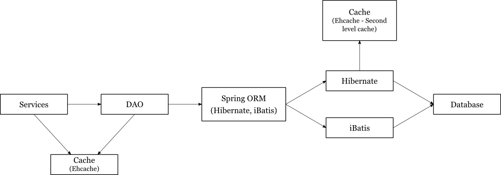

## 3.2 Object Relation Mapping (ORM) - Hibernate & IBatis

Go uses a relational database for datastore. ORM layer helps in mapping the java domain objects to the corresponding database tables and columns.

Hibernate and IBatis are used for the O/R mapping. Spring orm framework(*v3.1.3*) integrates Hibernate(*v3.3.2*) and IBatis(*v2.3.4.726*) to the rest of the Go application. 
The Data access layer defines DAOs which extend the corresponding DaoSupport classes exposed by Spring. These are responsible for interacting with spring to get hold of session object to query/persist the domain entities.

Go development started with using IBatis. Since then, we have moved some of the mappings to hibernate which makes the mapping and data-access much easier. While we hope to be able to use only one tech-stack for the ORM layer someday, we haven't seen enough benefits of one over the other yet to complete this herculean task.

``applicationContext-dataLocalAccess.xml`` defines database related beans and contains ORM tool settings.

### 3.2.1 Hibernate:
``applicationContext-dataLocalAccess.xml`` defines session-factory and transaction-manager for Hibernate.
*'hibernateProperties'* are defined in ``HibernateProperties``.
Hibernate mapping files are located under ``server/src/hibernate-mappings`` folder. 
As data is extensively cached , load strategy is set to be non-lazy for all entities.

##### Caching

Apart from the first level cache which is enabled by default, Second level cache with ``read-write`` concurrency has been enabled for a few entities, such as User, NotificationFilter, and EnvironmentVariableConfig. 

eg: in Entity.hbm.xml <pre>``<class name="com.thoughtworks.go.domain.Entity" table="entities">
  <cache usage="read-write"/>
  ...
</class>``</pre>

We also use query cache while querying these entities. Invalidation of first and second level cache is taken care of by hibernate.
We have stuck to custom caching for most of the other entities as we began to notice performance deterioration because of the way second level cache in Hibernate works. Such cached entries need to be invalidated explicitly.

### 3.2.2 IBatis:

Ibatis mapping files are located under ``server/src/com/thoughtworks/go/server/dao/maps/``. An entry needs to be made into ``server/webapp/WEB-INF/sql-map-config.xml`` when a new mapping-xml file is added.

eg:
``<sqlMap resource="com/thoughtworks/go/server/dao/maps/<New Entity>.xml"/>``

##### Caching

Query results are explicitly cached for large and frequent queries. Cache invalidation is also handled explicitly within code.

