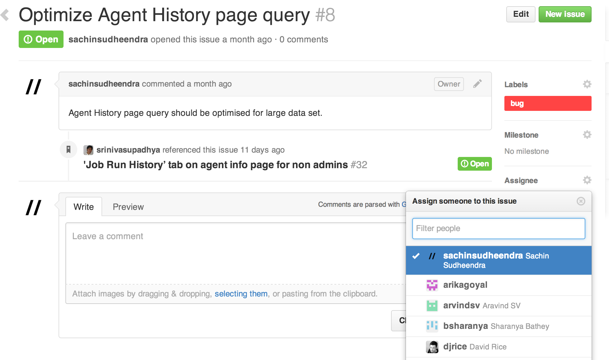

# 3.4 How to go about making changes to the codebase

## 3.4.1 Prerequisites

If your development environment is not set up, please refer to [3.1 Setting up your development environment](3.1.md) for the steps to set up the Go development environment.

## 3.4.2 Assigning an issue

Upon chosing a bug to fix, he/she should assign the bug to his/her name on github.

- Open [github issues](https://github.com/GoCD/GoCD/issues?state=open)
- Assign a bug



- Optionally, start a conversation around the proposed approach (and/or) any questions that you need answers for

## 3.4.3 Fixing the issue

As a demonstration, let us assume a use case of changing the case of one of the header links, namely PIPELINES. The task at hand would be,

> As a user
> I would like to change the case of the header link, i.e., **PIPELINES** to **pipelines**
> So that I can demonstrate how to make changes in Go.

Below are a set of steps that one would follow to achieve this

- Use an IDE to open the codebase. In our case, we shall use IntelliJ IDEA Community

- Locate the rspec file for the intended change. In our case, the header links are present in a file at ```server/webapp/WEB-INF/rails/app/views/shared/_application_nav.html.erb```. By the convention that Go follows, the equivalent rspec for the views are present under ```server/webapp/WEB-INF/rails/spec/views/shared/_application_nav_html_spec.rb```

- Identify the spec which tests this behaviour, or in our case, the view markup.

```
describe :header do
    before :each do
      template.stub!(:url_for_path).and_return('url_for_path')
      template.stub!(:url_for).and_return('url_for')
      template.stub!(:can_view_admin_page?).and_return(true)
    end

    it 'should have the header links' do
      render :partial => "shared/application_nav.html.erb"

      assert_header_values = {'recent-activity' => 'PIPELINES', 'environments' => 'ENVIRONMENTS', 'agents' => 'AGENTS', 'admin' => 'ADMIN'}

      response.body.should have_tag("ul.tabs") do
        assert_header_values.each do |key, value|
          with_tag("li#cruise-header-tab-#{key}") do
            with_tag("a", value)
          end
        end
      end
    end
  end
```

- Change rspec to reflect the expected behaviour

```
diff --git a/server/webapp/WEB-INF/rails/spec/views/shared/_application_nav_html_spec.rb b/server/webapp/WEB-INF/rails/spec/views/shared/_application_nav_html_spec.rb
index 8f577f3..c523e89 100644
--- a/server/webapp/WEB-INF/rails/spec/views/shared/_application_nav_html_spec.rb
+++ b/server/webapp/WEB-INF/rails/spec/views/shared/_application_nav_html_spec.rb
@@ -38,7 +38,7 @@ describe "/shared/_application_nav.html.erb" do
       render :partial => "shared/application_nav.html.erb"
-      assert_header_values = {'recent-activity' => 'PIPELINES', 'environments' => 'ENVIRONMENTS', 'agents' => 'AGENTS', 'admin' => 'ADMIN'}
+      assert_header_values = {'recent-activity' => 'pipelines', 'environments' => 'ENVIRONMENTS', 'agents' => 'AGENTS', 'admin' => 'ADMIN'}
       response.body.should have_tag("ul.tabs") do
```

- 