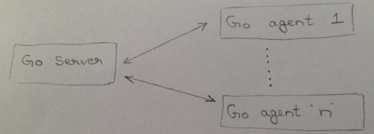

# 5 Architecture of Go

## 5.1 Overview

At the highest level, Go consists of two main components, the Go Server (referred to as "server") and the Go Agent
(referred to as "agent"). The agents communicate with the server, asking it for the next job to run. The server
coordinates everything else, making sure that all the builds that need to run get run.

## 5.2 Go Server

The Go server is made up of multiple sub-systems, communicating between themselves using ActiveMQ message queues and the
database. The main sub-systems in the Go server are:

* Material update sub-system
* Scheduling sub-system
* Work assignment sub-system

#### Material update sub-system (MDU)

This sub-system is called MDU for historical reasons (originally, "Material Database Updater"). It runs off of a timer
and a method is invoked on it periodically. Every time it gets called, it does this:

- Checks each material to see if there are any new commits.
- If found, it puts information about them into the database (modifications).

You can read more about this [here](5.2.3.md).

#### Scheduling sub-system (Scheduler)

It runs off a timer and a method is invoked on it periodically. Every time it gets called, it does this:

- For every automatically schedulable pipeline (ignoring timer triggered pipelines, manual pipelines, paused pipelines,
  etc), checks if any new modification is available for one of its materials.
- If available, it schedules a build (creates jobs to be run).

You can read more about this [here](5.2.5.md).

#### Work assignment sub-system

This sub-system gets activated by the agent communicating with the server. Every time an agent communicates with the
server, the server assigns a matching job to the agent, based on the job's resources and environment.

You can read more about this [here](5.2.6.md).

#### Other sub-systems

Apart from these three main sub-systems, there are some other sub-systems and modules worth mentioning:

* Configuration management module
* User interface (UI) sub-system
* Plugin sub-system

#### Configuration management module

Largely made up of the two smaller modules, config-server and config-api, in code, the configuration management module
is responsible for all of the activities around serializing and deserializing the configuration object from and to the
configuration XML.

You can read more about this [here](5.2.1.md).

#### User interface (UI) sub-system

This subsystem is composed mainly of a Rails application running on JRuby, fronted by the Jetty web server, with
Spring's Web MVC framework for the servlets. All HTTP and HTTPS requests get routed through Jetty and Spring, through a
URL rewriting layer and then comes to Rails' routing layer.

You can read more about this [here](../4/4.6.md).

#### Plugin sub-system

This sub-system is responsible for communication with all the plugins in the system and the framework around them,
including installation and registration, to handling missing plugins. It is used by other sub-systems, as needed. In
code, the modules involved in this sub-system are go-plugin-api, go-plugin-activator, go-plugin-infra and
go-plugin-internal-api.

You can read more about this [here](5.4.1.md).
