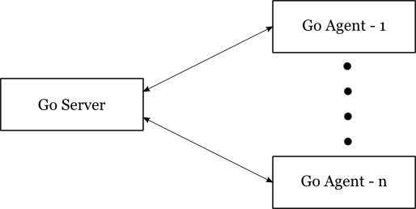

## 5.1 Overview

At the highest level, Go consists of two main components, the Go Server (referred to as "server") and the Go Agent
(referred to as "agent"). The agents communicate with the server, asking it for the next job to run. The server
coordinates everything else, making sure that all the builds that need to run get run.

As soon as the server comes up, it opens two ports (an SSL port and a non-SSL port). The system works on a pull model in
the sense that the agents periodically poll the server for work, instead of the server pushing work to the agents. This
prevents the agents from having to have listening ports open on their side.

You can read more about the internals of the Go Server [here](5.2.md).

You can also read more about the internals of the Go Agent [here](5.3.md).
