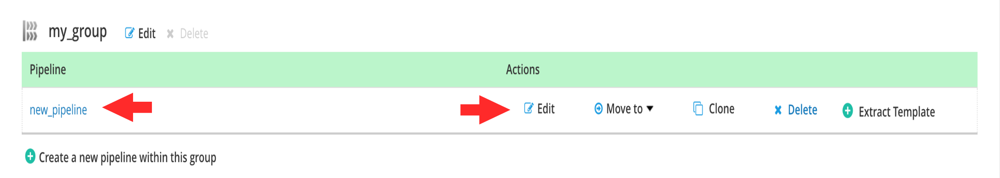
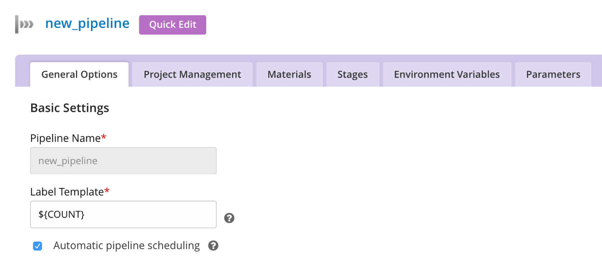
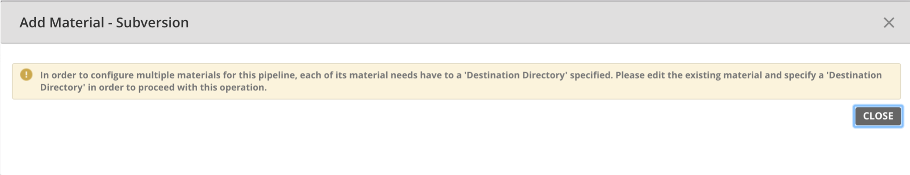
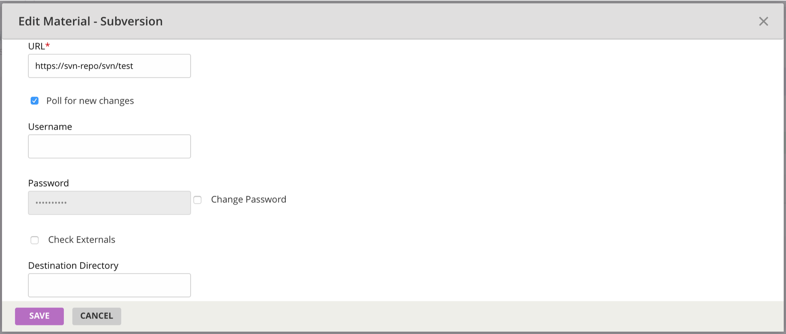
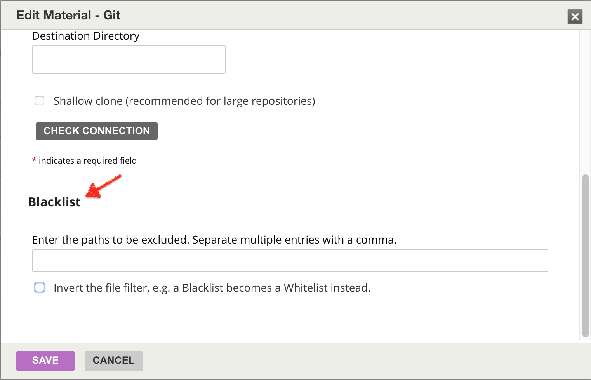

# Add a new material to an existing GoCD pipeline

Now that you have a pipeline, lets add another material to it.

-   Navigate to the new pipeline you created by clicking on the **Edit** link under the Actions against it. You can also click on the name of the pipeline.

-   Click on the Materials tab.

-   You will notice an existing material . Click on the "Add new material" link.

-   You will get the following message

-   Edit the existing material and specify the destination directory

-   Click "Save".

## Blacklist 

Often you do want to specify a set of files that GoCD should ignore when it checks for changes. Repository changesets which contain only these files will not automatically trigger a pipeline. These are detailed in the [ignore](configuration_reference.md#ignore) section of the [configuration reference.](configuration_reference.md)

-   Enter the items to blacklist using ant-style syntax below

-   Click "Save".
