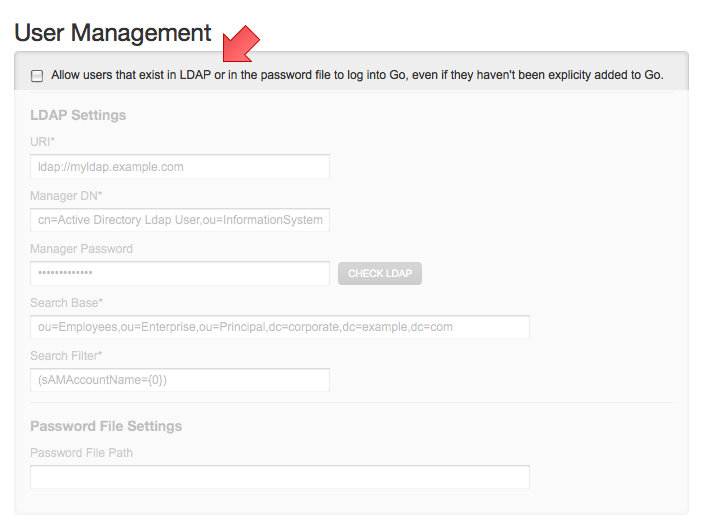

# Authentication

Go was built from the bottom up with security in mind. Go server provides both an http service and an https service by default. The http service listens on port 8153 and the https service listens on port 8154.

You can use both password file and LDAP/ActiveDirectory authentication at the same time. In this case Go will first try and authenticate you against the password file. If it cannot find your username, or if it finds that your username and password do not match, it will try LDAP/AD next. This can be very useful if you need a read-only user that can be used by scripts, and you do not want to add this user to your LDAP.
Support for in-built Password-File based and LDAP authentication has been disabled. Alternatively, GoCD provides extensions through [Authorization Endpoints](https://plugin-api.gocd.org/current/authorization/) using which plugins can provide authentication and authorization services backed by any authorization service providers like LDAP, Google, Github etc.

By default, GoCD does not require users to authenticate. However, users can be forced to authenticate by installing and configuring any of the [Authorization plugins](https://plugin-api.gocd.org/current/authorization/). GoCD comes bundled with a [Password File based](https://github.com/gocd/filebased-authentication-plugin) and [LDAP/AD](https://github.com/gocd/gocd-ldap-authentication-plugin) authentication plugins.

## File Based Authentication

_**Please note**_: The [SHA-1](https://en.wikipedia.org/wiki/SHA-1) algorithm is outdated. For increased security use LDAP or one of the 'Authentication Plugins' at https://www.gocd.io/plugins.

The simplest way to authenticate people is to create a password file for Go to use. This is just a plain text file with the following format:

```
[username]:[password hashed with SHA1 and encoded with base 64]
```

If your SHA1 algorithm and base 64 encoding works properly, the password "badger" should come out as "ThmbShxAtJepX80c2JY1FzOEmUk=".

You can put as many username/hashed password pairs as you like -- use a new line for each one.

To configure Go to use a password file for authentication:

1.  Login to Go as an admin
2.  Navigate to the "Admin" section
3.  Click on the "Server Configuration" tab
4.  Fill out the "Password File Settings" field under the "User Management" section


Go should pick up this change immediately and start authenticating new users (note that anybody already using Go will be required to re-authenticate).

The file format for the password file is the [standard one for Java Properties](http://docs.oracle.com/javase/7/docs/api/java/util/Properties.html#load%28java.io.Reader%29), which means that spaces, the equals sign, and the colon are special characters in the username and must be escaped with a backslash.


### Generating passwords using htpasswd

You can use the [htpasswd program from Apache](http://httpd.apache.org/docs/2.0/programs/htpasswd.html) to manage your password file. **You must use the -s option with htpasswd to force it to use SHA1 encoding for the password.** So for example, you can use the following command to create a password file called "passwd" and put the password for the user "user" in it:

```shell
htpasswd -c -s passwd user
```

### htpasswd on Windows

htpasswd is not available on windows, but there are plenty of [websites](http://www.google.com/search?q=generate+htpasswd+sha) that perform the encryption for free. Make sure you use the SHA1 algorithm.

### htpasswd on Mac OSX

htpasswd is already installed by default on Mac OSX.

### htpasswd on Linux

Debian based distributions (e.g. Ubuntu) htpasswd can be installed from the apache2-utils

```shell
$ apt-get install apache2-utils
```

### Generating passwords using python

Another option is to use the following command (assumes python is installed on your system)

```shell
$ python -c "import sha;from base64 import b64encode;print b64encode(sha.new('my-password').digest())"
```

## LDAP/ActiveDirectory Authentication

Go can authenticate against an LDAP or Active Directory (AD) server. Go uses the standard JNDI APIs to access LDAP/AD, using the well known Acegi Security framework. Go uses "bind" authentication to authenticate directly to the LDAP/AD server.

Note that LDAP/AD Authentication can be complex to configure. We highly recommend that you work with your network administration staff to configure this feature.

To configure Go to use LDAP/AD for authentication:

1.  Login to Go as an admin
2.  Navigate to the "Admin" section
3.  Click on the "Server Configuration" tab
4.  Fill out the "LDAP Settings" under the "User Management" section


The **Manager DN** is the LDAP/AD manager user's DN, used to connect to the LDAP/AD server.

The **Manager Password** is the LDAP/AD manager password, used to connect to the LDAP/AD server. Use the 'change password' checkbox to edit the password.

The **Search Base** is the name of the context or object to search in for the user record. If you have more than one search base, please separate each of them with a new line.

The **Search Filter** is the expression used in the user search. It is an LDAP search filter as defined in [RFC 2254](http://www.ietf.org/rfc/rfc2254.txt) with optional parameters -- in this case, the username is the only parameter. An example might be:

```
(uid={0})
```

which would search for a username match on the uid attribute, or

```
(sAMAccountName={0})
```

which would search for a username match on the sAMAccountName attribute (for ActiveDirectory users)

Click on Check LDAP button to check if your LDAP configuration is correct. This will bind to the LDAP server using the credentials provided in Manager DN and Manager Password.

Check LDAP will report an error if Search Base contains invalid **dc** information. However, it will not detect invalid **ou**

The authentication operation has two steps: firstly, Go uses the Manager DN and Manager Password supplied to search for the user using the searchBase and searchFilter attributes. Go will search subtrees and time out after five seconds. Go then uses the DN returned to attempt to bind to LDAP/AD using the username and password supplied by the user.

Note that Go doesn't retrieve any further information from LDAP/AD such as roles, groups or email address. It simply gets the user's CN.

If multiple search bases are configured, Go server will look for the specified user in each search base, one after the other. It will stop searching when it finds the information in a search base. In case any of the search bases are invalid, Go server will log this information in the server log, but continue searching in the remaining search bases.

## Controlling User Access

Once a user is authenticated, Go checks to see if he is an existing user or a new user (logging in for the first time). If a new user, there are two behaviors Go can operate under:

<<<<<<< HEAD
-   Automatically register the new user in Go and continue with the login process. This option has implications on licensing because auto-registering any new user who is in LDAP might cause you to run over your license limit. So keep that in mind when using this option.
-   Deny access to the user if not already a registered Go user. New users will have to be explicitly added by an admin.
=======
-   Automatically register the new user in GoCD and continue with the login process.
-   Deny access to the user if not already a registered GoCD user. New users will have to be explicitly added by an admin.
>>>>>>> 06e893a3... Fixed broken URLs (#93)

To switch the mode in which the Go Server operates:

1.  Login to Go as an admin
2.  Navigate to the "Admin" section
3.  Click on the "Server Configuration" tab
4.  Set the "Allow users that exist in LDAP or in the password file to log into Go, even if they haven't been explicitly added to Go" checkbox



## Common errors

Below are few of the common errors you might encounter while integrating with an authentication provider

### Bad credentials

-   Invalid username/password combination. Please check if the combination is valid and try again.

### User [username] not found in directory

-   A user with [username] is not found in LDAP. Please check with your LDAP administrator to verify if the user exists.
-   Check with your Go Administrator to verify that the user with [username] exists in the LDAP search base configured in Go.

### Empty username not allowed

-   The user has supplied an empty username. Please enter a valid username in the field.

### Failed to authenticate with your authentication provider. Please check if your authentication provider is up and available to serve requests.

-   Your LDAP server could not be reached by Go Server. Please check with your LDAP Administrator to resolve connectivity issues, if one exists, between Go Server and LDAP.
-   Please check with your Go Administrator to verify that the LDAP configuration is correct. Also check the Go Server logs for errors.

### User license limit exceeded, please contact the administrator

-   This error is displayed when the number of users logged into Go has exceeded the number permited by the license. This typically happens when an existing license expires. It can also happen if a license which allowed certain number of users has been replaced by another which allows a lesser number of users.

### Your account has been disabled by the administrator

-   This error is displayed when the user trying to log into Go has been disabled by the administrator. Please check with your Go Administrator.
