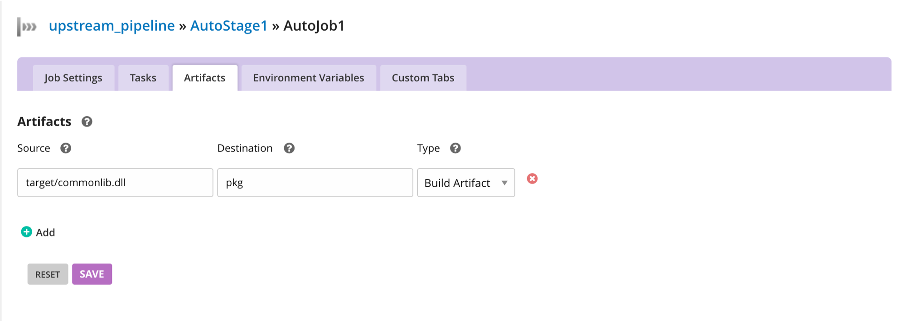

# Managing artifacts and reports

Because all your work is done on remote agents, Go provides a mechanism for files to be automatically uploaded to Go server following the completion of every job. These files can then be accessed via the Go server dashboard, or via the RESTful API.

## Publishing artifacts

The first step in using the artifact repository is to tell Go which files you want to publish. To do this just specify the path to the file or directory relative to the root of the source control checkout. You also need to specify where Go will publish the artifact. You can add as many files and directories as you like.

To configure an artifact:

-   Navigate to **Admin → Pipelines**
-   Edit the pipeline you want to configure artifacts for
-   Expand the left tree navigator and click on your job
-   Click on the **Artifacts** tab
-   Enter the source (where the artifact will be found) and destination (where the artifact should be saved on the Go server)



For power users, here's how you would configure this via Config XML:

```xml
<artifacts>
  <artifact src="target/commonlib.dll" dest="pkg" />
</artifacts>
```

## Using tabs

Once your artifacts are safely in Go server's artifact repository, you can have the dashboard display them in tabs.

Go can display images, text files, or anything else that a browser will normally render in an IFrame. If you display an html page which references other resources (such as images, Flash files or whatever), so long as the resources are referenced with relative paths, they will display correctly.

This mechanism is a simple way to include reports (for example code coverage) in Go.

#### Example

The console tab shows output information from all the phases of the job. This also includes information from the version control system and details regarding the artifacts created and published during the job.


If you produce an html page with an embedded Flash file into your artifact repository:


You can use the following configuration to display it in a tab:

```xml
<tabs>
  <tab name="Recording" path="deployment/drop/smoke/smoke-recording.html" />
</tabs>
```

Go will create a tab called "Recording" and display the contents of the file in the tab when you click on it:


### Publishing tests

Go has support for publishing tests from JUnit or NUnit test reports.

To configure a test artifact:

-   Navigate to **Admin → Pipelines**
-   Edit the pipeline you want to configure artifacts for
-   Expand the left tree navigator and click on your job
-   Click on the **Artifacts** tab
-   Enter the source (where the artifact will be found) and destination (where the artifact should be saved on the Go server)
-   From the **Type** dropdown, select **Test Artifact**


For power users, here's how you would configure this via Config XML:

```xml
<artifacts>
  <test src="xstream/target/test-reports" />
</artifacts>
```

Go will:

-   add a tab called Tests that lists the tests in the project
-   add a list of the failed tests to the Failures tab
-   set the properties associated with tests on the job. These include failed-test-count, ignored-test-count, test-time and total-test-count
-   copy the artifacts into the repository. In this case the test reports will be copied into a new directory test-reports in the artifact repository

### RESTful API

Go publishes all of its information as resources that can be queried through http in the form of RESTful API. See the [Go integration](../integration/index.md) page for more information.
