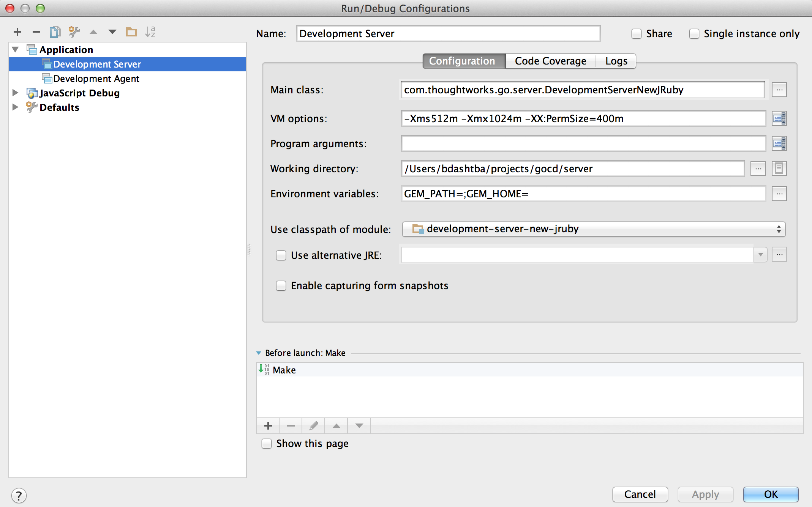
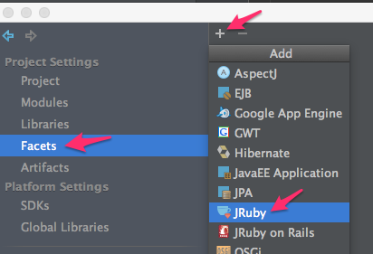
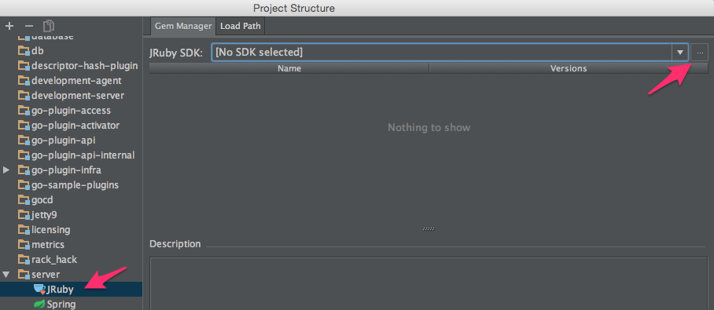
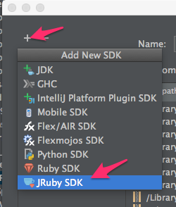
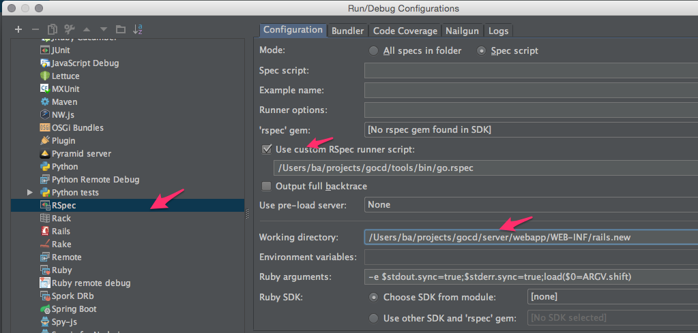

## 2.1 Setting up your development environment

### 2.1.1 Using vagrant to bring up the Go Development environment

> Supported versions: Vagrant **1.4.3+**, VirtualBox **4.3.6+**

The vagrant environment gives you a VM that has everything configured for Go to build and run. For convenience we have written two versions:

- Minimal Go Development Environment: Terminal view
- Gnome based Go Development Environment


You can use the environment in any one of the following two ways:

#### The easy way: Download a vagrant box

This gives you an Ubuntu Box with Gnome, the codebase and an IDE already installed.

[Vagrant box (Warning: Size is about 1.2GB)](http://download01.thoughtworks.com/go/vagrant/v2/go.v2.box)

[Vagrantfile](http://download01.thoughtworks.com/go/vagrant/v2/Vagrantfile)

Download both files and copy them into a (preferably an empty) directory. Running it is as simple as running the following in that directory:

```bash
vagrant up
```

If you choose this option, some parts below are not very relevant to you. You can continue to the section about the [development server](#dev-server-idea).

#### Alternatively, clone the repository containing the vagrant scripts by

```bash
~/projects$ git clone https://github.com/gocd/go-development-environment-setup.git
~/projects$ cd go-development-environment-setup
```

You can then do either of the following based on the OS you're running:

##### Setting up a minimal Go Development Environment (Linux/Mac) -

```bash
~/projects/go-development-environment-setup$ ./setup.sh
```

##### Setting up a minimal Go Development Environment (Windows) -

```bash
C:/projects/go-development-environment-setup$ setup.bat
```

##### Setting up a Gnome based Go Development Environment (Linux/Mac) -

```bash
~/projects/go-development-environment-setup$ ./setup.gui.sh
```

##### Setting up a Gnome based Go Development Environment (Windows) -

```bash
C:/projects/go-development-environment-setup$ setup.gui.bat
```

> Note: This version comes with the community edition of intelliJ installed, it opens up the Go project for you (if you don't see the DevelopmentServer configuration, restart intelliJ and check again). For additional details refer to section 2.1.3 & 2.1.4 of this document. 

#### Subsequent Runs

The above is just a one time setup. Once the VM is provisioned for subsequent runs, you can bring up the box by running

```bash
~/projects/go-development-environment-setup$ vagrant up
```

> Note: Network IO might be slow when configured to use NAT (default). You could change it to 'Bridged' mode to improve performance. In this mode, it necessitates that a network interface is chosen upon boot. Add the line below in the Vagrantfile to enable 'Bridged' mode:


>```
>config.vm.network :public_network
>```

#### Building & Running Go on the VM

After the provisioning, you should automatically get logged into the ubuntu virtual machine (using Virtualbox) environment.

In the minimal version, you will be dropped into the shell. In the Gnome version, you need to go to a terminal. Go code is checked out into /home/vagrant/go directory. 

To get Go up and running do the following:

```bash
cd /home/vagrant/go
./bn clean cruise:prepare dist
```

Once this is complete, you can verify that the setup happened correctly, by navigating into go/target/go-server-**version**. In case of Go 14.1.0, 

```bash
cd go/target/go-server-14.1.0
bash server.sh
```

Access Go server from the **host** machine by accessing the application at **http://localhost:8153** which should bring up the Go dashboard. When running in development mode, the default username is "admin" and password "badger"

> Note: At times due to port collision, the Go server might be forwarded to a different port. You should be able to find information about it in the console itself. 

#### Virtual machines credentials
```
Username: vagrant
```

The vagrant user does not have any password. To set the password use `passwd` command.

### 2.1.2 Setting it up manually

Go requires the following software packages to build

-   JDK 7 (OpenJDK or Oracle)
-   Git (1.7+)
-   Maven (3.1.1+)

Assuming the codebase is cloned into **~/projects/go**, you need to execute the
following commands to build Go

```bash
~/projects/go$ unset GEM_HOME GEM_PATH
~/projects/go$ ./bn clean cruise:prepare dist
```

After a successful build, the build artifacts are generated inside a directory
named "**target**" in the working directory. The output directory contains JARs
along with the packaged ZIP installer for Go Server and Go Agent.

```bash
~/projects/go$ ls target
agent
agent-bootstrapper
...
go-agent-14.1.0
go-server-14.1.0
...
util
```

### 2.1.3 Building via IntelliJ IDEA

If you have IntelliJ IDEA configured, you could optionally use it to build Go. 

Prior to build via the IDE, we would have to prepare the working directory by copying the database deltas to the configured location. You can achive this by runnning the below command in the working directory.

```bash
~/projects/go$ ./bn clean cruise:prepare
```

After the preparation phase has succeeded, 

- Open the project in IDEA
- Build -> Rebuild project

### <a name="dev-server-idea"></a>2.1.4 Running Development Server via IntelliJ IDEA

When developing using IntelliJ IDEA, it is always convenient to run the Go Server in *development mode*. Apart from the convenience, you also get

- Live debugging
- Faster feedback
- Hotswapping changes while the JVM is up

The IDEA **Application** run-configuration can be setup using the values below:

```
Name: Development Server
Main Class: com.thoughtworks.go.server.DevelopmentServer
VM options: -Xms512m -Xmx1024m -XX:PermSize=400m
Working directory: <project-directory>/server
Environment variables: GEM_PATH=;GEM_HOME=;
Use classpath of module: development-server
```

Configuring IntelliJ IDEA *run-configuration*


Running *Development Server* from IntelliJ IDEA


### 2.1.5 Running Development Agent via IntelliJ IDEA

The IDEA **Application** run-configuration can be setup using the values below:

```
Name: Development Agent
Main Class: com.thoughtworks.go.agent.DevelopmentAgent
Working directory: <project-directory>/agent
Use classpath of module: development-agent
```

### 2.1.6 Running rspec tests via IntelliJ IDEA

You need to make sure that IDEA knows about the classpath to run Go.

- Run the rake task to create system properties file for IDEA
  ```bash
  ~/projects/go $ rake --rakefile server/run_rspec_tests.rake export-system-properties-file-for-idea
  ```
- Configure the project and set the JRuby SDK
  1. Right-click the root of the project in the navigation bar and click `Open Module Settings`
  2. Open the `Facets` tab
  3. Click the + sign and create a `JRuby` facet, select the `server` module as the target
     
  4. Click on your newly created `JRuby` facet and click on the `...` button next to SDK dropdown
     
  5. Click the + sign and select `JRuby SDK`, select `New local...` in the popup 
     
  6. Select the `jruby` executable `~/projects/go/tools/rails/bin/jruby` and click `OK`. 
  7. The selection will close and it'll take a while for IDEA to create a new SDK in the sidebar. 
     Select it and click `OK`.
  8. With your new SDK configured it's time to add a `JRuby on Rails` facet,
     click on the + sign and select `JRuby on Rails` and choose the `JRuby`
     facet for `server` that you just finished configuring
  9. Click `OK` to exit the module settings configuration
- Configure the default RSpec run configuration
  1. Open `Run -> Edit configurations...`
  2. Open the `Defaults` section and select `RSpec` in the listing
  3. Check the `Use custom RSpec runner script` checkbox
  4. Select `go.rspec` from `~/projects/go/tools/bin/go.rspec`
  5. Set the working directory to `~/projects/go/server/webapp/WEB-INF/rails.new`
     
  6. Click `Apply` to save
  7. Open a spec file and run it `Run -> Run 'somefile_spec.rb'`, or `Ctrl+Shift+F10`
