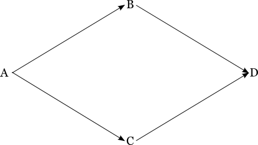

## 5.2 Fan-in

Go supports multiple SCM/pipeline dependencies. There are a lot of challenges that come up because of it. Dependency management is one of them. 

Consider the below case:

1. G is git repo containing code for the application
2. A is pipeline that runs unit tests & prepares the installer as an artifact
3. B is pipeline that runs integration tests - is triggered after A
4. C is pipeline that runs acceptance tests - is triggered after A (pulls artfiact from A)
5. D is pipeline that deploys the application which requires both B & C to be green. (pulls artfiact from A)


```
G -> A -> B -> D
     |         |
     + -> C ---+
```

Now consider a checkin made to G, say g1, which has flown through A (a1), B (b1), C (c1) & D (d1).

Now there is another commit g2, for which instances A (a2) has gone green, B (b2) & C (c2) are running.

Now b2 goes green. There is a valid new revision for D to run with - b2 & c1 (since both were green). If D goes ahead and deploys the application:

* What if c2 goes red (with failing tests)?
* What if c2 goes green? Should D trigger again (for b2 & c2)? Wouldn't it be a wasteful deployment?

Another problem that D would face is that C & D need to pull artifact from A for deployment. But if D is triggered with b2 (which triggered off of a2) & c1 (which triggered off of a1), Which version of A should be considered for the artifact fetch?

To solve these problems we wrote a feature in Go which does not trigger D until both B & C go green for a particular commit. Once both go green say b2 & c2. D has a consistent revision of A (a2) to fetch the artifact from. It will also reduce wastefull runs of D. i.e. D will not run twice & it will not run at all in case both the pipelines do not go green for a revision.

### 5.2.1 <a name="overview"></a> Overview

#### Challenges:

Fan-in is the most complex feature in Go. It took us really long to develop & test it, especially because it was a change in the core of Go (Scheduling). It went through 3 algorithm re-writes, it is really hard to debug/pin down issues because of the recursive nature of algorithm and has lot of tricky corner cases.

##### Efficiency:

The algorithm had to be effecient since there are 1000+ pipelines in some of our customer setups. And, Go tries to schedule 10 pipelines every second using 10 threads, which meant that if the algorithm for scheduling took longer, then the threads will be blocked for that much more time. This would drastically increase the amount of time Go takes to detect a check-in & schedule pipelines that can trigger off of that change.

#### Graph Representation & Instance Data population

To be able to implement the algorithm we needed to have a Graph representation of the whole of the upstream. To build this, we traverse the config recusively from the current pipeline i.e., the pipeline that is supposed to be triggered, and store all pipelines & SCMs that we come across. We populate the parent & child information in the nodes during the traversal. Go maintains a data-structure called Pipeline timeline. It stores pipeline instances for each pipeline in "schedule order" & "natural order" separately.

### 5.2.2 <a name="pipeline-timeline"></a> Pipeline Timeline

#### Schedule order

The order in which pipeline instances got triggered. This is simply based on the pipeline counter.

Ex: If pipeline P ran 3 times, instances being P1, P2 & P3 with trigger times T1, T2 & T3 respectively, with T1 < T2 < T3, then schedule order would be P1, P2, P3.

#### Natural order

The pipeline instances ordered by SCM commit time. 

Ex: If pipeline P depends on git G which has 3 commits G1, G2 & G3 with commit times T1, T2 & T3 respectively, with T1 < T2 < T3. P1 has triggered with G1, while P2 has triggered with G3 & P3 has triggered with G2, then the natural order would be P1, P3, P2.

This data-structure can be used if you are trying to find a pipeline instance that is older than the current instance in terms of code.

Ex: In the above example, say the current pipeline instance is P3 and you want an older instance of the pipeline. P2 is not an older instance since it has a newer commit (g3), but P1 is an older instance since it has an older commit (g1).

### 5.2.3 <a name="algorithm"></a> Algorithm

```
resolve_revisions(graph)
  make sure there is atleast one revision available for all upstream dependencies
  
  make sure there is atleast one upstream pipeline dependency
  /* If not then no resolution is required & pipeline can run with latest revisions for all upstream dependencies.
     This check can be more intelligent to check if there actually is a fan-in / just a direct dependency in which case you do not need fan-in resolution. */
  
  initialize all upstream materials to latest revision
  
  make_all_SCM_revisions_same
end

def make_all_SCM_revisions_same
  boolean hasChanges = true
  while(hasChanges)
    foreach(Pipeline upstream : upstream_pipeline_dependencies)
      hasChanges = set_revision(upstream)
      
      if (hasChanges)
        break
      end
    end
  end
end

def set_revision(pipeline)
  scm_revisions_that_differ = find_SCM_revisions_that_differ()

  if (scm_revisions_that_differ.isEmpty)
    return false
  end

  scm_revision = get_oldest_SCM_revision(scm_revisions_that_differ)

  alter_revision(pipeline, scm_revision)

  return true
end

def find_SCM_revisions_that_differ
  foreach(SCM scm : upstream_SCM_dependencies)
    reference_scm_revision = get_SCM_revision_from_any_upstream_pipeline()
    scm_revisions = {reference_scm_revision}
    foreach(Pipeline pipeline : upstream_pipeline_dependencies)
      if (pipeline.has_SCM_dependency(scm) && pipeline.revision_for(scm) != reference_scm_revision)
        scm_revisions.add(pipeline.revision_for(scm))
      end
    end
    if (scm_revisions.size() != 1)
      return scm_revisions
    end
  end
  return {}
end

def alter_revision(pipeline, scm_revision)
  set pipeline instance to something that has run with scm_revision / some revision older than scm_revision
end

```

### 5.2.4 <a name="corner-cases"></a> Corner Cases

Sample fan-in dependency.



General reasons for auto-triggered downstream pipelines to not trigger (without errors):

1. If both the pipelines B & C have mutually exclusive blacklists, i.e. say A has 2 folders ’src/’ ’test/’ and B ignores test/ while C ignores src/ and there are no commits to both folders together, then B & C run for different commits of A. This leaves D with no compatible runs of B & C that it can trigger off of.

2. If the upstream pipelines B & C are timer triggered/manually triggered they always run off of latest change in A. So, if you trigger B & C at different times they may have different revisions of A, causing incompatibility for D.

3. The algorithm always goes down during its search for compatibility. Consider below scenario:

```
G -> A -> C
|         |
+ -> B ---+
```
Say, the commits for repository G are in order g1 < g2 < g3.

* A has run a1 (with g1), a2 (with g3).
* B has run b1 (with g1), b2 (with g3).
* C has run c1 (with a1 & b1).
* Before C runs with a2 & b2, A is triggered for a3 (with g2).

Now during fan-in resolution for C, we see g2, so look for B with <= g2, find b1 (g1). Now we look for A with <= g1 find a1 (g1) and resolution stops at a1, b1, g1 with which C has already run. So it doesn't run. Even though there is newer revision of B & C available which are compatible! (a2 & b2)

General reasons for auto-trigger downstream pipelines to not trigger (with errors):

1. If one of the pipelines, say B, is paused/manual and has not run for long, while the other pipeline (C in this case) runs constantly then the resolution of downstream D fails after a few runs of C. This is because Go tries to resolve the upstream pipelines by considering maximum upto 100 instances of each upstream pipeline after which it will stop resolution to avoid consuming too many CPU cycles.

2. If an upstream pipeline (say B) is triggered with a older version of A then Go tries to find a version of C which is compatible with that version of A or something older than that. This can fail if you select a version of A that is very old for the same reason as above.

3. If the config of an upstream pipeline is changed. Say you change A -> X OR add/remove a material to either of B/C, the resolution of D will fail until there is a green run of all upstream pipelines with the latest material config.
Fan-in algorithm is used for resolving the correct upstream dependency revisions only for pipelines that are set to auto-trigger. It does not take effect when you manually trigger a pipeline or if the pipeline is timer triggered.

### 5.2.5 <a name="extensions"></a> Extensions

Add fan-in resolution for trigger with options. User can open the revision selection popup, select revisions for the materials user cares for & click 'resolve revisions' which could resolve the revisions for other upstream materials & fill the pop-up. This would help users select consistent upstream revisions without having to manually resolve them.

Provide "resolve & trigger" button. This is an extension of the first "resolve for trigger with options" feature. People want pipeline to be manual trigger but want it to be consistent.

Handle corner cases better. May be an improved algorithm which covers more cases than the current one. Atleast provide easily consumable warnings/error messages when resolution fails. Users must be able to debug the problem by themselves.
