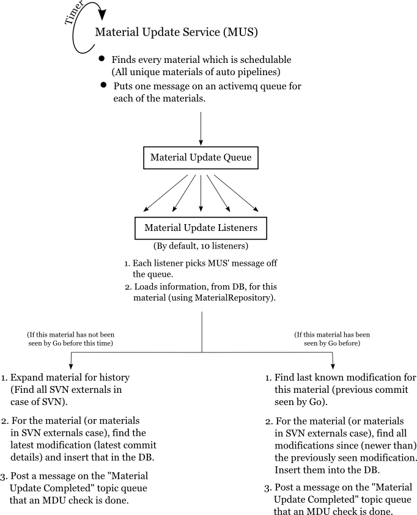

### 4.2.3 Material update sub-system (MDU)

This sub-system is called MDU for historical reasons (originally, "Material Database Updater"). As its name suggests,
its job is to update the materials configured in the system to their latest state. For SCM materials, this means
recording commits which have happened since the last time they were checked; for package materials, this means giving
the plugins a chance to find newly uploaded packages, and so on.

Here is an overview of its internals:

---------------------------------------

---------------------------------------

The MDU (specifically, the ``MaterialUpdateService`` class being the starting point of this sub-system), gets a timer
triggered callback periodically. When it gets that, it uses the configuration to find all the [unique
materials](4.2.3.1.md) across pipelines.

For each unique material found, it sends a message to the ``MaterialUpdateQueue``. Now, the ``MaterialUpdateListeners``
will pick up the messages and do an MDU check for the material specified in the message. Once a new commit is seen, they
use the ``MaterialRepository`` to insert information about the commit into the database. This information about the
commit is called "Modification".

Once this update is done (or no new commit or change was found), a message is sent back to the
``MaterialUpdateCompletedTopic`` to notify other parts of the system that an MDU check was completed. This message is
subscribed to and listened for by the scheduler sub-system as well as the MDU itself to do various tasks they need to do
after an MDU check is done.

### Some other concepts related to the MDU

#### Idle time

Not every unique material found will actually be checked every time. There is a configurable "idle" time (defined by the
system property ``material.update.idle.interval``), which specifies the minimum time which should elapse between two MDU
checks for a material. Every time the timer is triggered, this interval is checked. If the MDU check for this material
has been run within the interval time, the material is skipped and will be checked again, when the timer is triggered
the next time.

#### In-progress material update

If a material update takes a long time, longer than the timer interval, then there is a possibility of another MDU check
starting for the same material. This can cause issues with version control systems. To prevent this, the server keeps
track of every material in the queue and makes sure that another MDU check will not start for the same material. If a
material is taking a long time to update, then you might see a log message about skipping its update and about it being
in-progress.
