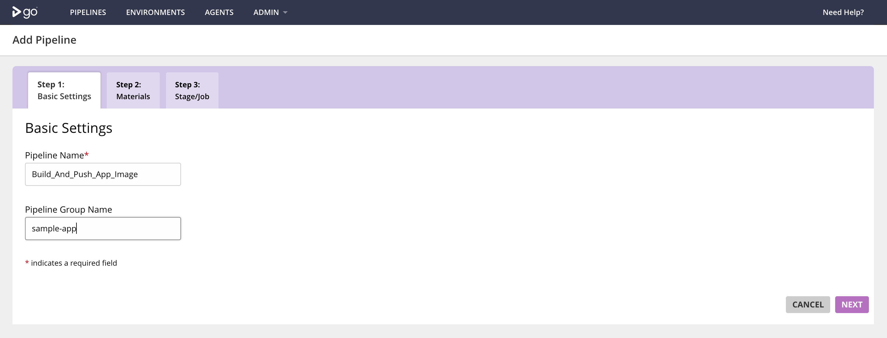
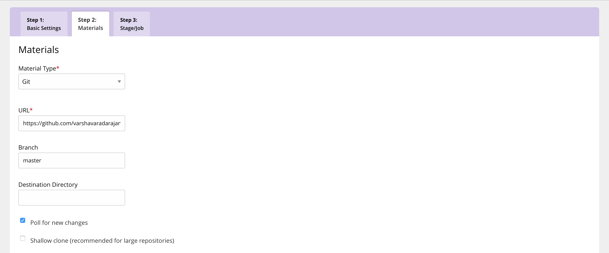
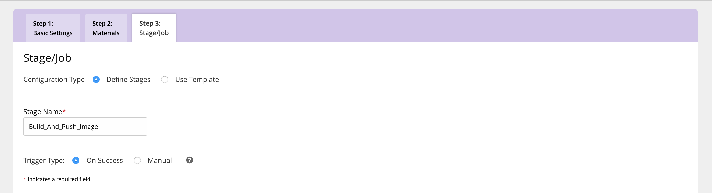
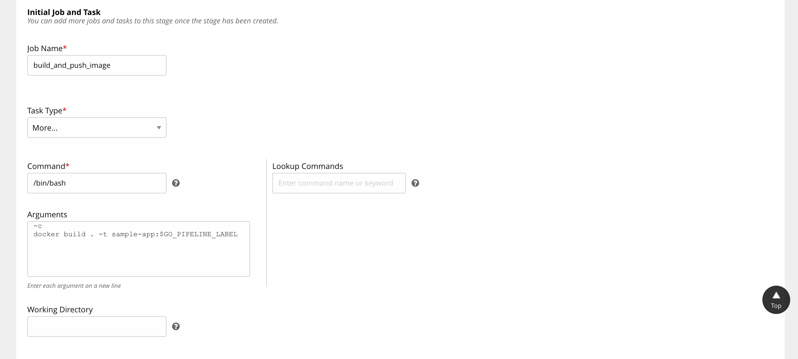
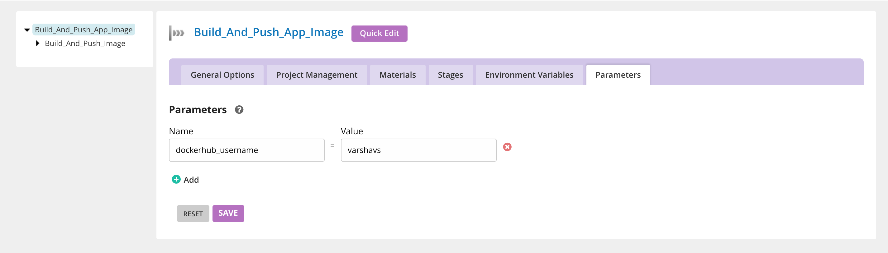
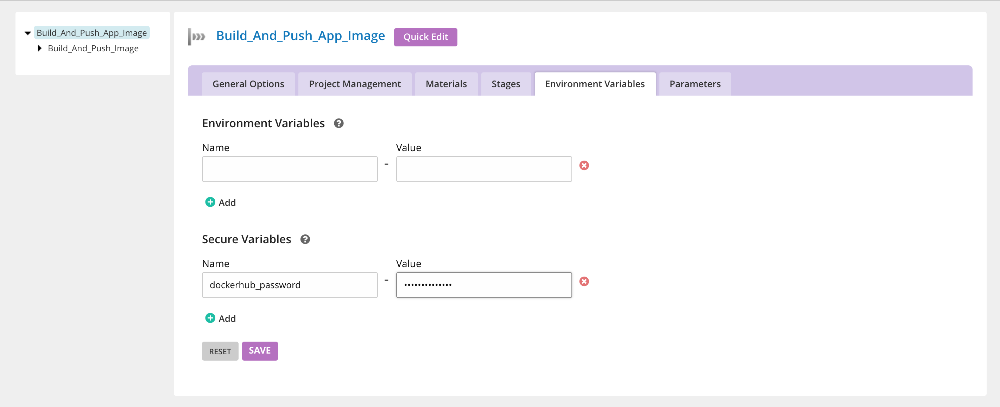
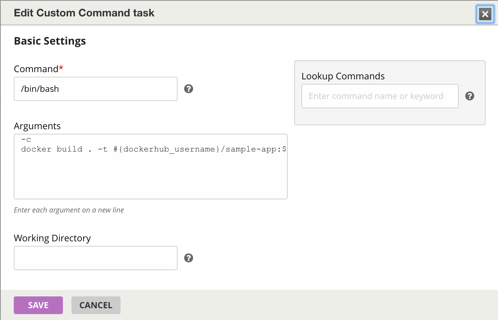
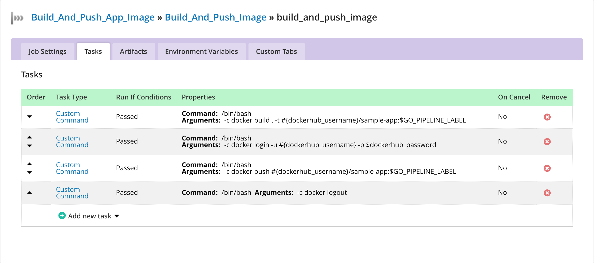
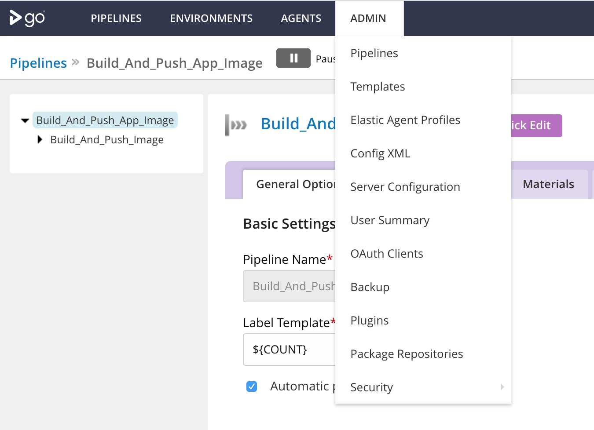
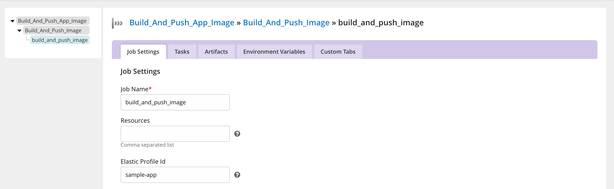

## Deploy a sample application

Install the GoCD Helm chart with the below command: 

```bash
helm install incubator/gocd --name gocd --namespace gocd
```

Once the cluster and the GoCD helm chart installation is completed, you're ready to use GoCD to build and deploy a containerized application to a Kubernetes cluster.

1. The GoCD server dashboard can be accessed from the ingress IP. 
 - On minikube, the IP address is the output of `minikube ip`
 - Generally, the IP address can be obtained by doing:
 
 ```bash
    ip=$(kubectl get ingress --namespace gocd gocd-gocd-server -o jsonpath="{.status.loadBalancer.ingress[0].ip}")
    echo "http://$ip"
 ```

The first screen will look like - 


2. Create the build pipeline

This pipeline will be used for building a docker image from a dockerfile and pushing it to DockerHub.

- Specify the pipline name and the group name like below: 


- Specify a git material with repo `https://github.com/varshavaradarajan/docker-workflow.git`


- Create a stage called `Build_And_Push_Image`


- Create a job `build_and_push_image` with an initial build task. The GO_PIPELINE_LABEL is an environment variable provided by GoCD which can be used to differentiate between builds from a repository. Here we are using that to determine the application image tag.


- Once you click on `Finish`, the pipeline is created. However, we still need to configure a number of tasks to push the image to DockerHub.
Configure the dockerhub username as a parameter in the `Parameters` tab.


- Configure the dockerhub password as a secure variable in the `Environment Variables` tab.


- Edit the initial docker build task to include the dockerhub username. 


- Configure the following tasks to push to DockerHub


3. Configure the Kubernetes Elastic Agent Plugin Settings
Now that the build pipeline is configured, let's focus on actually running the pipeline to build and push the docker image. 
The GoCD Helm chart comes shipped with the [Kubernetes elastic agent](https://github.com/gocd/kubernetes-elastic-agents.git) to bring up the GoCD agent pods on demand. Everytime there is a job to execute, this plugin is responsible to bring up a pod in the kubernetes cluster to run the job.
Refer to the [GoCD Elastic Agent blogpost](https://www.gocd.org/2017/08/08/gocd-elastic-agents-benefits/) to understand more about the GoCD Elastic Agents. 

- We must first configure the plugin to point to the right Kubernetes cluster and provide enough details so that the plugin will be able to bring up the agent pods. To configure the plugin, Navigate to the plugins page from the Admin dropdown. Click on the gear icon for the Kubernetes Elastic Agent plugin to edit the settings. 


- The GoCD server URL is required for the agents brought up by the plugin to connect to the GoCD server. An private GoCD server IP within the Kubernetes cluster can be obtained and specified.
```bash
echo "https://$(kubectl --namespace=gocd get service gocd-gocd-server -o jsonpath='{.spec.clusterIP}'):8154/go"
```

- The Cluster URL indicates the Kubernetes cluster in which the GoCD agent pods must be brought up. This can be obtained by `kubectl cluster-info`

- Namespace: The namespace wherein the helm chart was installed. As specified above, the namespace is `gocd`.

- The Service Account Token: The token specified must be associated with a service account that has the following privileges.
Privileges:
    - nodes: list, get
    - events: list, watch
    - namespace: list, get
    - pods, pods/log: *


4. Create an elastic profile
An elastic profile is the configuration which is specific to the GoCD Elastic agent. While the plugin configuration deals the with global details about the Kubernetes cluster itself, the profile configuration can be used to bring up different kinds of agent pods within the same cluster to run different kinds of jobs.
Details like the GoCD agent image and the resources that must be provided to the container is specified here.

To configure an elastic profile, go to Admin -> Elastic Profiles. Make sure to provide an Docker In Docker image and check the privileged mode checkbox as we are using this profile to build the docker image.
 


5. Associate profile with jobs

Now that the agent related setup is complete, we can associate the elastic profile with the `build_and_push_image` job and run the pipeline.




6. Run Pipeline and Verify

Now that the build pipeline is configured. We can run it and verify that the docker image has been pushed. To run the pipeline, unpuase the pipeline in the GoCD dashboard. The changes in the source git repository is picked up automatically and the pipeline is triggered. 

Once the pipeline run is finished, you can go to your DockerHub account and verify if the image has been pushed. 