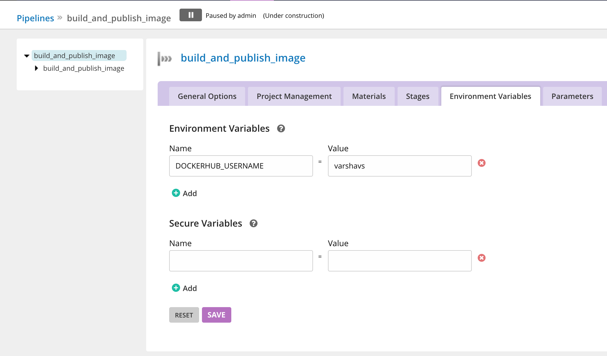

# Creating a build pipeline

Now that you have accessed the dashboard successfully and created your elastic agent profiles, you’re ready to start creating your build pipeline. 

## Configuring your build pipeline

In this example, we’ll create a pipeline that will be used for building a docker image from a dockerfile and pushing it to DockerHub. 

You can follow the steps below to configure your build pipeline. 

- Specify the pipeline name and the group name. 

- Specify a git material with repository `https://github.com/bdpiparva/node-bulletin-board`

- Create a stage called `build_and_publish_image`

- Create a job called `build_and_pubish_image` with an initial task argument `docker build -t $DOCKERHUB_USERNAME/bulletin-board:$GO_PIPELINE_LABEL . -f Dockerfile.application`.
The `GO_PIPELINE_LABEL` is an environment variable provided by GoCD which can be used to differentiate between builds from a repository. Here we are using that to determine the application image tag.

*Note: This is the job that we have to associate with the elastic agent profile that we created earlier.*  

- Once you click on Finish, your pipeline is created! 

At this point, we have created a pipeline but we need to configure the tasks to actually push the image to DockerHub. To do this,

- Configure the `DOCKERHUB_USERNAME` and `DOCKERHUB_PASSWORD` as environment variables

- Add the following task in the screenshot below to test the image.

*Note:Choose the More option in the Add New Task dropdown*

- Add the following tasks shown in the screenshots below to push the image to Dockerhub

## Associate the job with the elastic profile

Before you can run the pipeline, you’ll need to make sure you have associated the [elastic profile]((../gocd_helm_chart/configure_k8s_ea_plugin.md#create-an-elastic-profile)) we previously with the job to be executed. In our example of building a pipeline for GoCD on Kubernetes, we’ve used `build_and_publish_image` . Once you’ve associated the job to the profile, you’re ready to run the pipeline.

## Verifying your build pipeline

Now that the build pipeline is configured, we can run it and verify that the docker image has been pushed. To run the pipeline, `unpuase` the pipeline in the GoCD dashboard. The changes in the source git repository get picked up automatically when the pipeline is triggered.

Once the pipeline run is finished, you can go to your DockerHub account to verify if the image has been pushed.

