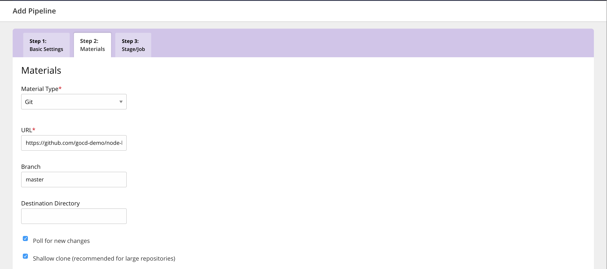
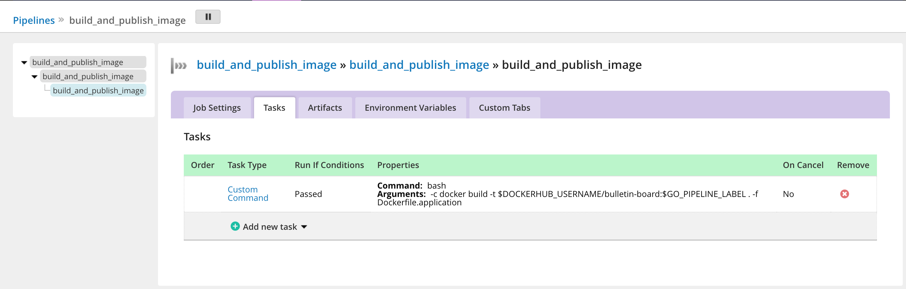
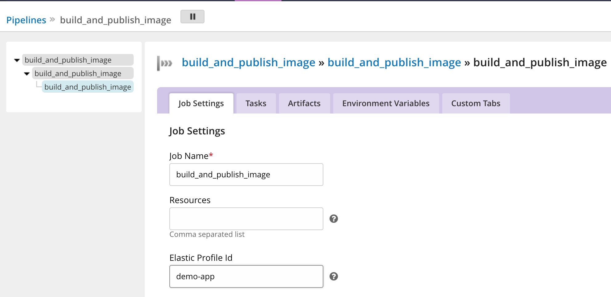

# Create a pipeline to build and publish your application artifact

In this section, we cover how to design CD pipelines that build and publish application [artifacts](https://docs.gocd.org/current/introduction/concepts_in_go.html#artifacts). For this example, you'll need a [Dockerhub](https://hub.docker.com) account. 

## Build an application artifact

In this example, we’ll build a docker image artifact and publish it to DockerHub.

1. Click on the `Pipelines` link on the top menu to create your first pipeline.

2. Specify the [pipeline](https://docs.gocd.org/current/introduction/concepts_in_go.html#pipeline) name and the group name as `build_and_publish_image` and `kubernetes_app_deployment` respectively.

  

3. Specify a git [material](https://docs.gocd.org/current/introduction/concepts_in_go.html#materials) with repository `https://github.com/bdpiparva/node-bulletin-board`.

  

4. Create a [stage](https://docs.gocd.org/current/introduction/concepts_in_go.html#stage) called `build_and_publish_image`.

  

5. Create a [job](https://docs.gocd.org/current/introduction/concepts_in_go.html#job) called `build_and_publish_image` with an initial task argument
```bash
   docker build -t $DOCKERHUB_USERNAME/bulletin-board:$GO_PIPELINE_LABEL . -f Dockerfile.application
```

  > The `GO_PIPELINE_LABEL` is an environment variable provided by GoCD which can be used to differentiate between builds from a repository.

  Here we are using `GO_PIPELINE_LABEL` to determine the application image tag.

  *Note: This is the job that we have to associate with the elastic agent profile that we created earlier.*

  

## Publish your application artifact

At this point, we have created a pipeline but we need to configure the tasks to push the image to DockerHub. To do this,


1. Configure the `DOCKERHUB_USERNAME` and `DOCKERHUB_PASSWORD` as environment variables.

  

2. Create a task under the `build_and_publish_image` stage with the following command that executes tests.

  ```bash
    docker run $DOCKERHUB_USERNAME/bulletin-board:$GO_PIPELINE_LABEL npm test
  ```
  *Note:Choose the More option in the Add New Task dropdown*

  

3. Create tasks for the following Docker commands that push the image to Dockerhub.

  ```bash
    docker login -u $DOCKERHUB_USERNAME -p $DOCKERHUB_PASSWORD
  ```

  

  ```bash
    docker push $DOCKERHUB_USERNAME/bulletin-board:$GO_PIPELINE_LABEL
  ```

  

3. This is what the `Tasks` under the `build_and_publish_image` stage should look like once you finish this configuration

  

## Associate job with the elastic profile

Before you can run the pipeline, you’ll need to make sure you have created and associated an [elastic profile](elastic_profiles.md) with the job to be executed. You can do so on the `Job Settings` tab of a job.

In our example of building a pipeline for GoCD on Kubernetes, we're going to set the elastic profile for the `build_and_publish_image` job. Once you’ve associated the job to the profile, you’re ready to run the pipeline.

  

## Run your pipeline

Now that the pipeline has been configured, we can run it and verify that the docker image has been pushed. 

To run the pipeline, `unpause` the pipeline in the GoCD dashboard. The changes from the source git repository gets picked up automatically when the pipeline is triggered.


## Check the status of agents with Agent Status Report

When the pipeline is running (signified by a yellow bar), you can take a look at the status of the agents that are assigned to run the jobs in the pipeline. You can find the following information here
- pod details & configuration
- pod events
- logs for the agents

This can be useful to troubleshoot when an agent is not picking up the job. 

To access the agent status report, 

1. Click on a stage of your choice when the pipeline is being built. 

2. You'll see the stage detail page with a list of jobs. Click on the job that you wish to see the agents of.   

3. This is the job detail page which has a console log. Click on the button titled 'Check Agent Status'. 

    

4. Clicking on this will take you to the Agent Status Report where you can see --- 

    

*Note: The Agent Status Report is only visible when that particular job is running. Once the job is run, this status will not be visible.*

## Verify your pipeline

Once the pipeline has run successfully, you can go to your DockerHub account to verify if the image has been published.

In our [next section](creating_a_deploy_pipeline.md), we'll look at how to configure a pipeline to deploy our sample application onto a Kubernetes cluster.