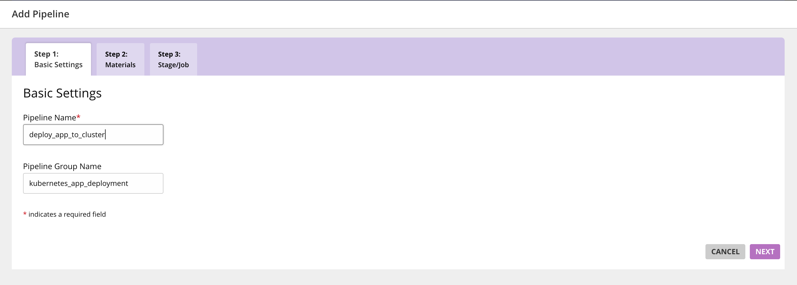
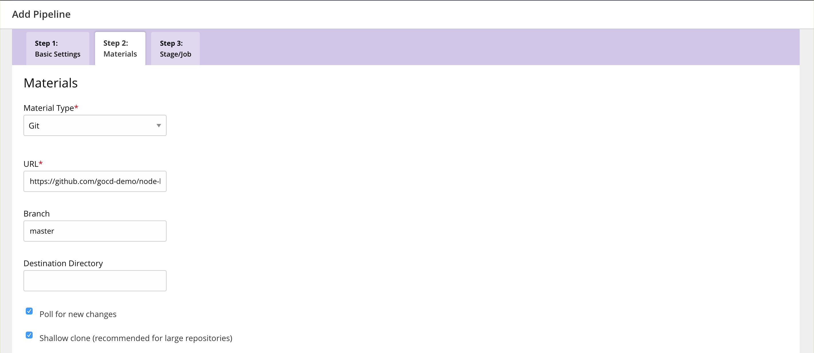
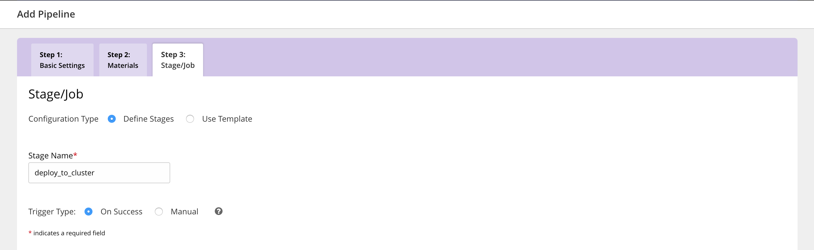
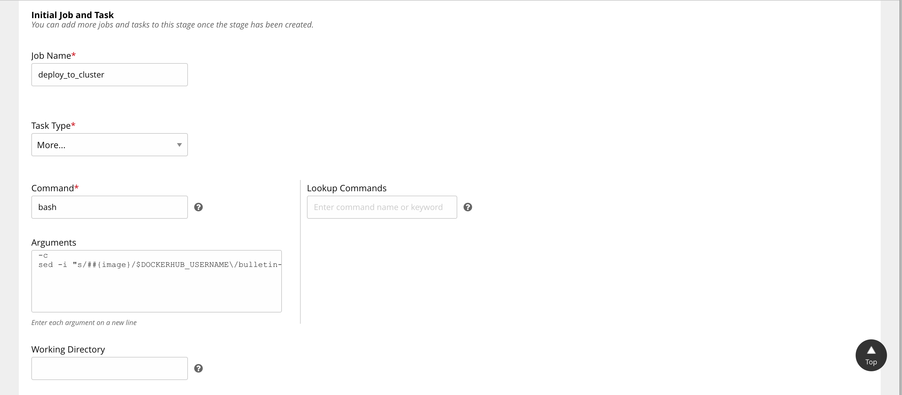
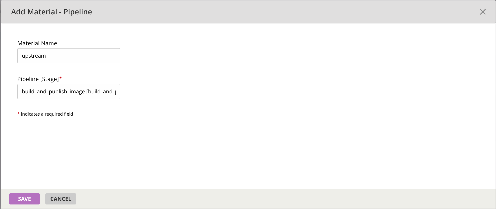
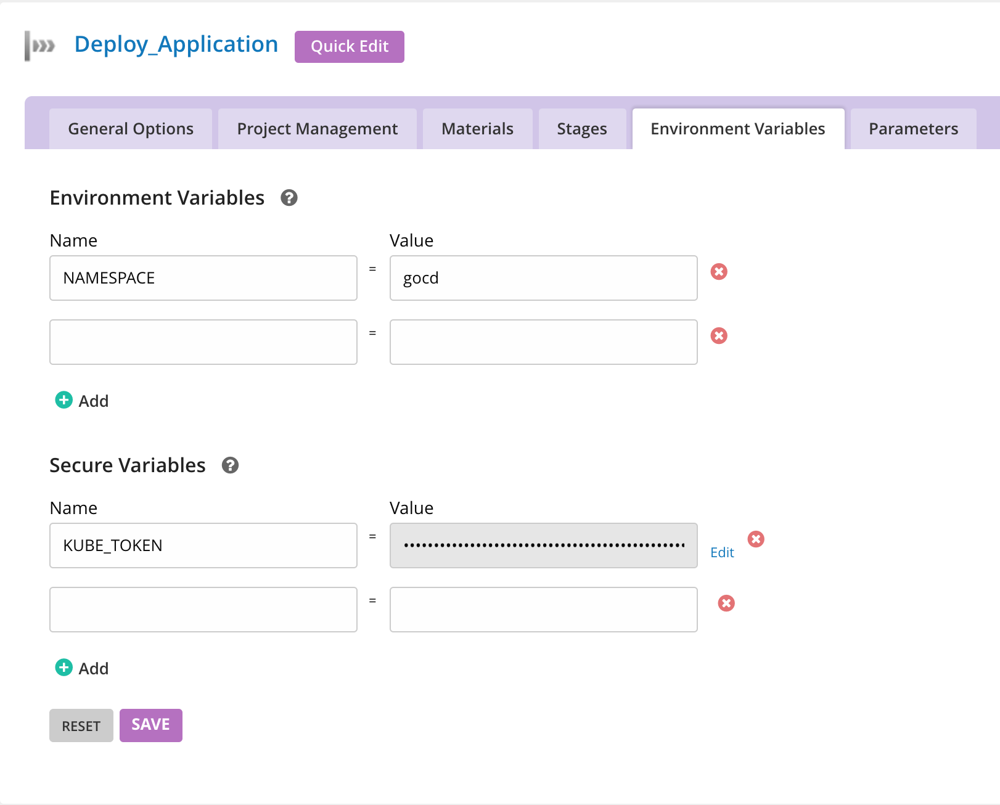
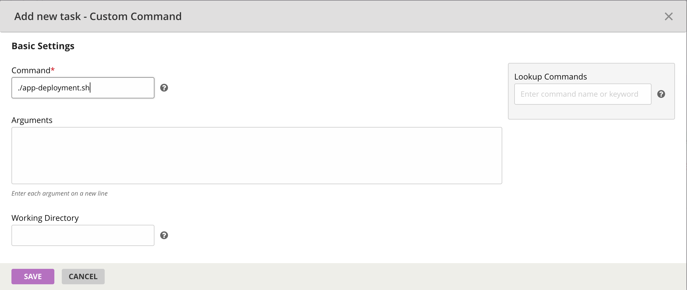
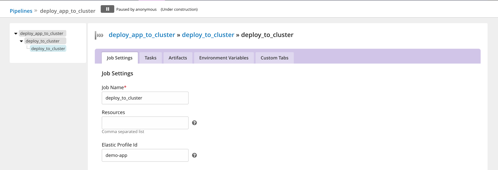
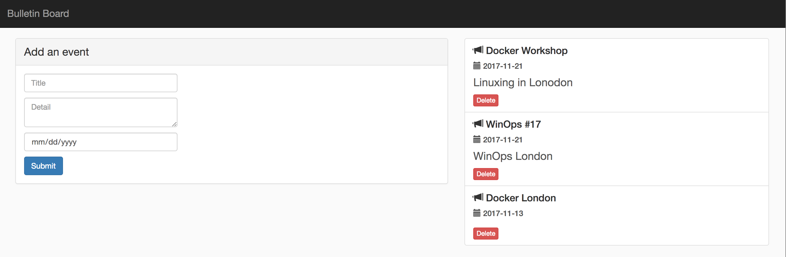

# Create a pipeline to deploy the published artifact

In this section, we’ll learn to design a deployment pipeline to deploy to Kubernetes. After you've designed and run the build pipeline, you'll see that for every successful build, a new image gets created with a new tag. To create a pipeline to deploy the published artifact, follow these steps:   

##### Quick Links

[Modeling Deployment Pipelines](https://www.gocd.org/tags/modeling-deployment-pipelines.html)

## Deploy application to Kubernetes
 
1. Navigate to Admin -> Pipelines and click on `Create a pipeline within this group`.

2. Specify the pipeline name as `deploy_app_to_cluster`.

    

3. Specify the git material with URL `https://github.com/gocd-demo/node-bulletin-board.git`. The deploy scripts are present in the same repository as the application source.

    

4. Create a stage named `deploy_to_cluster`.

    

5. Create the initial job `deploy_to_cluster`. The initial task argument is

    `sed -i "s/##{image}/$DOCKERHUB_USERNAME\/bulletin-board:$GO_DEPENDENCY_LABEL_UPSTREAM/" bulletin-board-deployment.json`

    *Note the extra '#'. GoCD offers additional environment variables (like $GO_DEPENDENCY_LABEL_*) to use in builds when a pipeline depends on another pipeline. We'll look at how to configure a dependency in the next step.*

    

6. Introduce the pipeline `build_and_publish_image` as a material called `upstream`. 
    
    *Tip: Choose the option 'Pipeline' in the 'Add Material' dropdown under the Materials tab.*

    We want to add the earlier pipeline to build the app as a dependency as we want this pipeline to run only after the docker image is built. 
    
    

7. Add the `NAMESPACE`, `DOCKERHUB_USERNAME` and `KUBE_TOKEN` environment variables.

    > The `KUBE_TOKEN` secure environment variable is needed when we make a Kubernetes API requests to create deployments, service and ingress.
    For convenience, you can use the secret associated with the service account we used to start the `Tiller` pod: `kube-system:default`.  

    *Note: The KUBE_TOKEN environment variable must be configured as a secure variable as shown in the image. This token should not be exposed.*
    
    ```bash
    kubectl describe sa default --namespace kube-system // to obtain the secret name
    kubectl describe secrets <token_name> --namespace kube-system
    ```

    

8. Configure a task to call the `./app-deployment.sh` script.

    

## Associate job with the elastic profile

*Note: You’ll need to make sure you have [created an elastic profile](creating_a_build_pipeline.md#create-an-elastic-profile) before you proceed.*

Before you can run the pipeline, you’ll need to associate an elastic profile ID with the job to be executed. To do this, go to the `Job Settings` tab of the specific job.

*Tip: Use the tree on the left to navigate to the job `deploy_to_cluster`. Once you're here, you can associate the profile ID under the Job Settings tab.*

Once you’ve associated the job to the profile, you’re ready to run the pipeline.



## Run your pipeline

Now that the deploy pipeline is configured, we can run it and verify that the deployment has been completed.

To run the pipeline, unpause the pipeline in the GoCD dashboard. The changes in the source git repository get picked up automatically when the pipeline is triggered.

## View the value stream map

You can view the value stream map of your deployment by clicking on the 'VSM' link of the `deploy_app_to_cluster` pipeline in the Dashboard. 


## Access your application

Once the pipeline has run successfully, go to `http://<ingress-ip>/bulletin-board` to see your deployed sample application.

Get the new ingress IP address for the application by doing

- For Minikube,

```bash
minikube ip
```
- For others,

```bash
echo "http://$(kubectl get ingress bulletin-board-ingress --namespace $NAMESPACE -o jsonpath="{.status.loadBalancer.ingress[0]['ip']}")"
```


