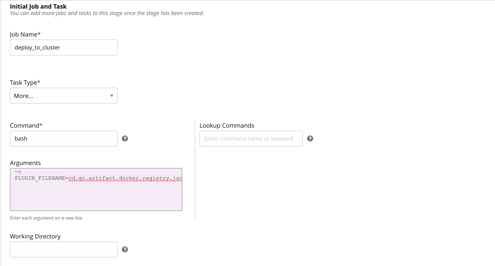
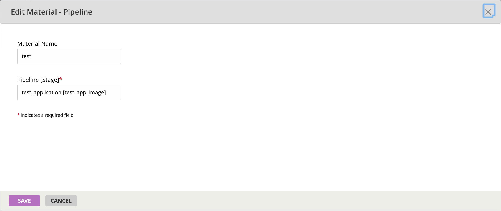
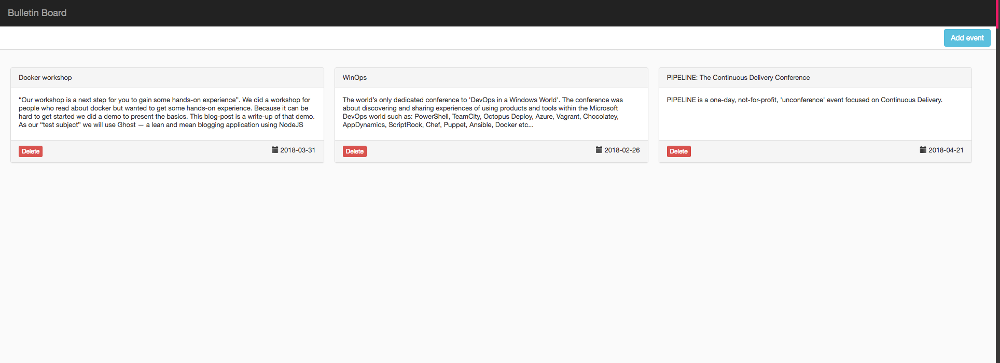

# Create a pipeline to deploy the published artifact

In this section, we’ll learn to design a deployment pipeline to deploy to Kubernetes. After you've designed and run the build pipeline, you'll see that for every successful build, a new image gets created with a new tag. To create a pipeline to deploy the published artifact, follow these steps:   

1. Navigate to Admin -> Pipelines and click on `Create a pipeline within this group`.

2. Specify the pipeline name as `deploy_app_to_cluster`.

    

3. Specify the git material with URL `https://github.com/bdpiparva/node-bulletin-board`.

    

4. Create a stage named `deploy_to_cluster`.

    

5. Create the initial job `deploy_to_cluster`. The initial task argument is `sed -i "s/##{image}/$DOCKERHUB_USERNAME\/bulletin-board:$GO_DEPENDENCY_LABEL_UPSTREAM/" bulletin-board-deployment.json`.
*Note the extra '#'.*

    

6. Add a pipeline dependency

    We want the deploy pipeline to run only after the docker image is built. To ensure that, we can introduce the pipeline Build_And_Push_App_Image as a material called 'upstream'. GoCD also exposes additional environment variables to use in builds when a pipeline depends on another pipeline.

    

7. Add the `NAMESPACE`, `DOCKERHUB_USERNAME` and `KUBE_TOKEN` environment variables.

    > The `KUBE_TOKEN` environment variable is needed when we make a Kubernetes API requests to create deployments, service and ingress.
    For convenience, you can use the secret associated with the service account we used to start the `Tiller` pod: `kube-system:default`.  

    ```bash
    kubectl describe sa default --namespace kube-system // to obtain the secret name
    kubectl describe secrets <token_name> --namespace kube-system
    ```

    

8. Configure a task to call the `application-deployment.sh` script.

    

## Associate job with the elastic profile

Before you can run the pipeline, you’ll need to make sure you have [created an elastic profile](elastic_profiles.md) and associated it with the job to be executed. You can do so on the `Job Settings` tab of a job.


## Run your pipeline

Now that the deploy pipeline is configured, we can run it and verify that the deployment has been completed.

> To run the pipeline, `unpause` the pipeline in the GoCD dashboard. The changes in the source git repository get picked up automatically when the pipeline is triggered.

Once the pipeline has run successfully, go to `<ingress-ip>/bulletin-board` to see your deployed sample application.


