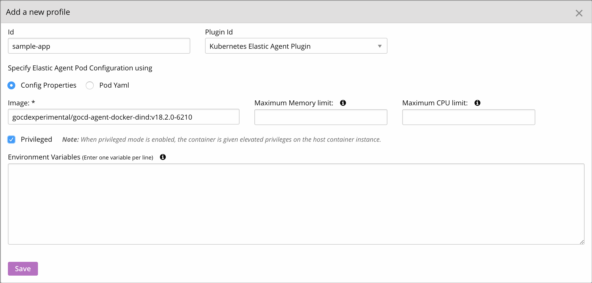

### Create an elastic profile

> An elastic agent plugin spins up GoCD agents on the fly. It needs to know what type of agent to spin up. An elastic profile specifies the type of GoCD Agent to be used by the elastic agent plugin. Using this, you can bring up different kinds of agent pods within the same cluster to run different kinds of jobs.

To configure an elastic profile, go to Admin -> Elastic Profiles. Make sure you provide a [Docker In Docker](../designing_a_cd_pipeline/docker_workflows.md) image and check the ‘Privileged mode’ checkbox. This mode is essential to run the Docker in Docker image.

