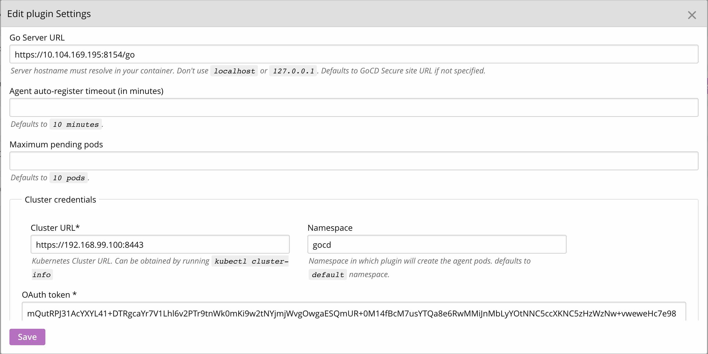
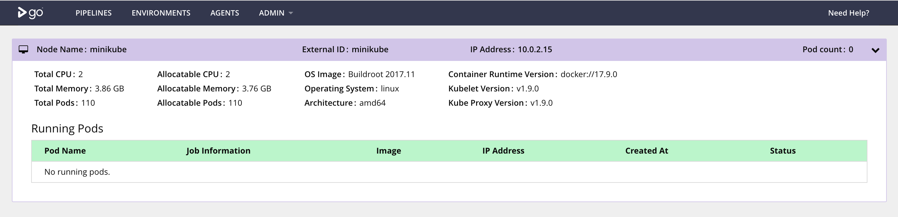

# Kubernetes elastic agent plugin

> GoCD agents are “workers” and execute tasks that make up jobs, stages and the pipeline. GoCD [Elastic agents](https://www.gocd.org/elastic-agents) spin up agents on demand, depending on the intensity of the tasks and availability of processing power.

The Kubernetes elastic agent plugin is bundled with the GoCD Helm chart. This plugin spins up GoCD agent pods in the Kubernetes cluster in response to build workload.

### Configure the Kubernetes elastic agent plugin

We need to configure the plugin to point to the right Kubernetes cluster. Navigate to the plugins page from the Admin dropdown. 

  

Click on the ‘gear’ icon for the Kubernetes Elastic Agent plugin to edit its settings.

  

This is a rundown of the attributes of the Kubernetes elastic agent

1. The GoCD Server URL is required for the agents brought up by the plugin to connect to the GoCD server. A private GoCD server IP within the Kubernetes cluster can be obtained and specified with the following command.
  
   ```bash
     echo "https://$(kubectl --namespace=gocd get service gocd-server -o jsonpath='{.spec.clusterIP}'):8154/go"
   ```

2. The Cluster URL indicates the Kubernetes cluster in which the GoCD agent pods must be brought up. This can be obtained by running the following command
  
   ```bash
     kubectl cluster-info
   ```
   The `Kubernetes master` url is the Cluster URL.

3. The Kubernetes namespace where the helm chart was installed needs to be specified. As mentioned in the installation guide above, the namespace we have used is `gocd`.

4. The Service Account token specified must be associated with a service account that has the following privileges
    - nodes: list, get
    - events: list, watch
    - namespace: list, get
    - pods, pods/log: *

   The token can be obtained by:
  
   ```bash
     secret_name=$(kubectl --namespace=gocd get serviceaccount gocd -o jsonpath="{.secrets[0].name}")
     kubectl --namespace=gocd get secret $secret_name -o jsonpath="{.data['token']}" | base64 --decode
   ```

5. Once you save your configuration, navigate to the plugin status report page from the plugins page and confirm that you don't have configuration errors.

   
