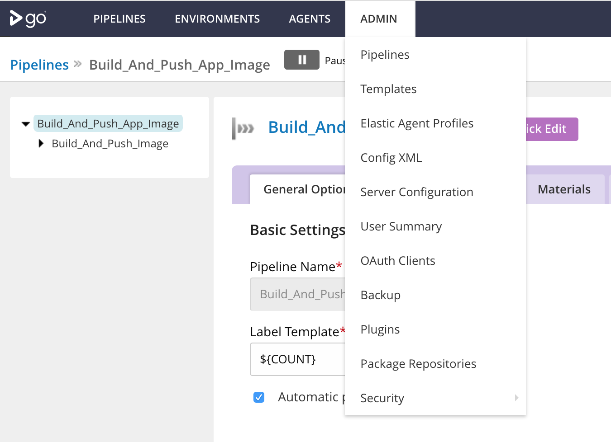
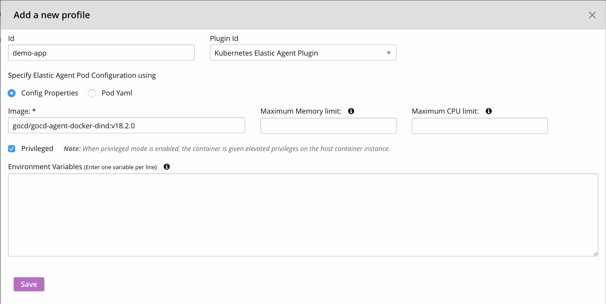

# Kubernetes elastic agent plugin and elastic profile

## Configure elastic agent plugin 

This section talks about the configuration of the elastic agent plugin that spins up GoCD agents on the fly. 

### What is the kubernetes elastic agent plugin?

In GoCD, agents are “workers” and execute tasks that make up jobs, stages and the pipeline. GoCD [Elastic agents](https://www.gocd.org/elastic-agents)  spin up agents on demand (depending on the intensity of the tasks and availability of processing power). 

The GoCD Helm chart ships with the Kubernetes elastic agent plugin. Every time there is a job to execute, this plugin is responsible to bring up a GoCD agent pod in the Kubernetes cluster to run the job. 
 
First we need to configure the plugin to point to the right Kubernetes cluster. The details provided will help the plugin bring up GoCD agent pods. To configure the plugin, navigate to the plugins page from the Admin dropdown. Click on the ‘gear’ icon for the Kubernetes Elastic Agent plugin to edit its settings.



This is a rundown of the attributes of the Kubernetes elastic agent: 

- The GoCD Server URL is required for the agents brought up by the plugin to connect to the GoCD server. A private GoCD server IP within the Kubernetes cluster can be obtained and specified with the following command.
```bash
$ echo "https://$(kubectl --namespace=gocd get service gocd-gocd-server -o jsonpath='{.spec.clusterIP}'):8154/go"
```
- The Cluster URL indicates the Kubernetes cluster in which the GoCD agent pods must be brought up. This can be obtained by running the following command.
```bash
$ kubectl cluster-info
```
- The Kubernetes namespace where the helm chart was installed needs to be specified. As mentioned in the installation guide above, the namespace we have  used is `gocd`.

- The Service Account token specified must be associated with a service account that has the following privileges: 
    - nodes: list, get
    - events: list, watch
    - namespace: list, get
    - pods, pods/log: *

The token can be obtained by:
```bash
$ secret_name=$(kubectl --namespace=gocd get serviceaccount gocd-gocd -o jsonpath="{.secrets[0].name}")
$ kubectl --namespace=gocd get secret $secret_name -o jsonpath="{.data['token']}" | base64 --decode
```


## Create an Elastic Profile

An elastic profile is the configuration which is specific to the GoCD Elastic agent. While the plugin configuration deals the with global details about the Kubernetes cluster itself, the profile configuration can be used to bring up different kinds of agent pods within the same cluster to run different kinds of jobs. Details like the GoCD agent image and the resources provided to the container are specified here.
To configure an elastic profile, go to Admin -> Elastic Profiles. Make sure to provide an [Docker In Docker](../designing_a_cd_pipeline/docker_workflows.md) image and check the ‘Privileged mode’ checkbox. This mode is essential to run the Docker in Docker image.



Once we have built the pipeline and created the jobs, we'll need to [associate the elastic profile with the job](#). We'll cover this in a later section. 