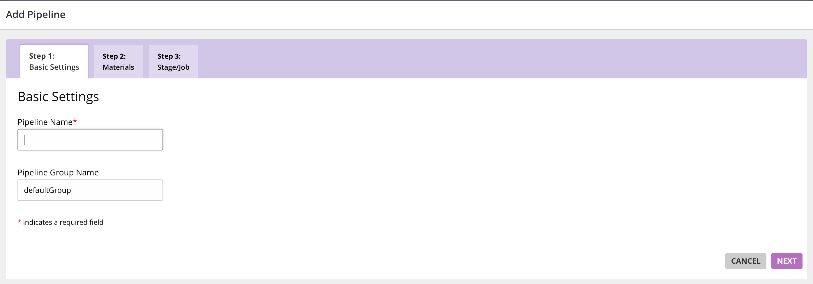

# Install the GoCD Helm chart

> Helm is a package manager for Kubernetes. Kubernetes packages are called charts. Charts are curated applications for Kubernetes.  


Install the GoCD Helm chart with these commands:

```bash
$ helm repo add stable https://kubernetes-charts.storage.googleapis.com
$ helm install stable/gocd --name gocd --namespace gocd
```

## Access the GoCD server dashboard

After you’ve installed the GoCD helm chart, you should be able to access the GoCD server dashboard from the Ingress IP.

The Ingress IP address can be obtained by using:
```bash
$ ip=$(kubectl get ingress --namespace gocd gocd-server -o jsonpath="{.status.loadBalancer.ingress[0].ip}")
$ echo "http://$ip"
```

On minikube, the IP address can be obtained by running the command

```bash
$ minikube ip
```

It might take a few minutes for the GoCD server to come up for the first time. You can check if the GoCD server is up with this command:

```bash
$ kubectl get deployments --namespace gocd
```

The GoCD server on startup will look like this.


Now that you have accessed the dashboard successfully, you will need to configure the Kubernetes elastic agent plugin.
