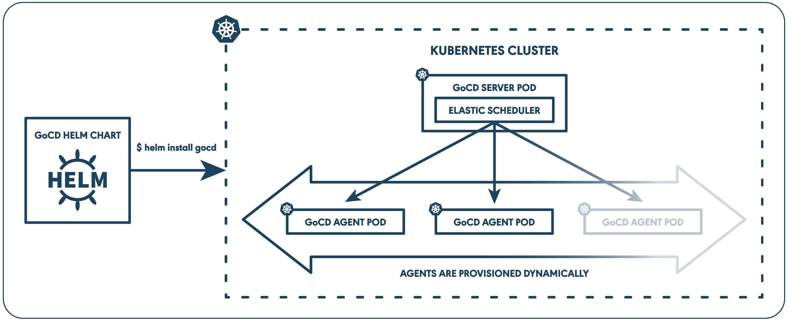

# Introduction

GoCD gives you the flexibility to effectively represent CD pipelines that suit your organization’s processes. Kubernetes gives you a highly programmable delivery infrastructure platform. And together, they provide the foundation for a powerful Continuous Delivery platform.

   

With this documentation guide, you’ll be able to

- Setup and configure an instance of GoCD on a Kubernetes cluster
- Design a continuous delivery pipeline to deploy a sample application
