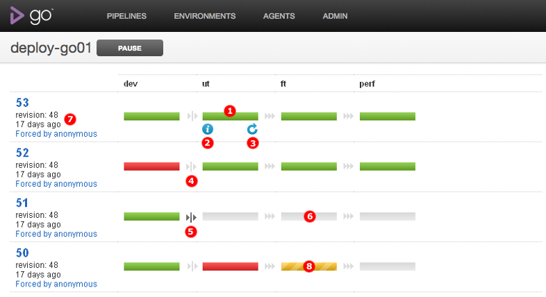

# Pipeline Activity in GoCD

The "Pipeline Activity" page shows the history of stages for each pipeline label over the life of a specific pipeline.

### Key

1.  The revision number and "Triggered by" provide a quick look at who activated this pipeline and why. Click "modified by" to show a list of comments and revisions.
2.  Hover over a stage in the pipeline configuration box to see info and stage re-run icon (see points 4 & 5 for further details).
3.  This indicates a manual gate, which is waiting for approval. This could be the case where a stage needs manual approval or when a stage has failed.
4.  Click the info icon which appears on a stage on hover to show [stage details](../navigation/stage_details_page.md).
5.  Use this button to re-run a particular stage. This option re-builds a stage and continues to build the subsequent stages thereon. This option is only available on a completed stage.
6.  This indicates a stage that has not yet been run.
7.  This indicates that the following stage has already been approved to run, either manually or automatically.
8.  An yellow color indicates that a stage is in progress.
9.  This indicate there is a change in configuration such as stagename update or stage trigger update.

##### Also see...

-   [Stage details](../navigation/stage_details_page.md)
-   [GoCD overview](../introduction/concepts_in_go.md)
