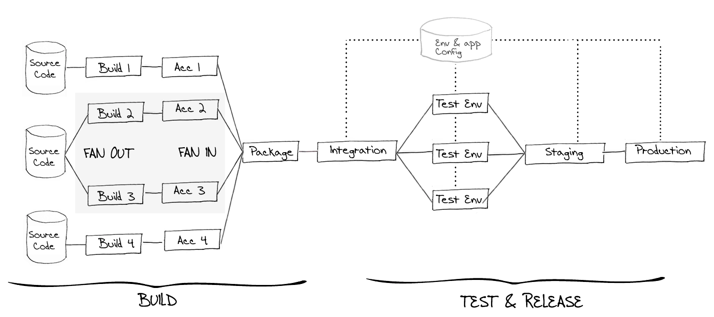

# Go User Documentation

Welcome to Go - an Open Sourced Continuous Integration and Release Management system. Automate and streamline the build-test-release cycle for worry-free, continuous delivery of your product.

## Licence

Copyright 2014 ThoughtWorks, Inc. You may copy, distribute, print, and display, all or portions of this documentation, as long as you do so without making changes to the text. We also kindly request that you include a link to the original. All rights not granted above are reserved.

## Contributing to this documentation

We're using [GitBook](https://github.com/GitbookIO/gitbook) for generating our HTML Docs from markdown files. It is hosted [here](http://go.cd/documentation/user), and if you would like to contribute, please send a pull request for the same.

## Index (from old documentation)

* [Introduction](./introduction/index.md)
    * [What's new in Go](./release_history/whats_new_in_go.md)
    * [Concepts in Go](./introduction/concepts_in_go.md)
* Installing Go
    * [System requirements](installation/system_requirements.md)
    * [Installing Go Server](installation/installing_go_server.md)
    * [Installing Go Agent](installation/installing_go_agent.md)
    * [Running Go without Installation](installation/run_go_without_install.md)
    * [Upgrading Go](installation/upgrading_go.md)
    * [Configuring Server Details](installation/configuring_server_details.md)
    * [Configure a Proxy](installation/configure_proxy.md)
    * [Performance Tuning](installation/performance_tuning.md)
* Using Go
    * [Setup a New Pipeline](configuration/quick_pipeline_setup.md)
    * [Managing Pipelines](configuration/managing_pipelines.md)
    * [Managing Agents](advanced_usage/managing_a_build_cloud.md)
    * [Managing Artifacts and Reports](configuration/managing_artifacts_and_reports.md)
    * [Managing Dependencies](configuration/managing_dependencies.md)
    * [Managing Environments](configuration/managing_environments.md)
    * [Managing Users](configuration/managing_users.md)
    * [Notifications](configuration/dev_notifications.md)
    * [Properties](advanced_usage/properties.md)
    * [Pipeline Labelling](configuration/build_labelling.md)
    * [Compare Builds](advanced_usage/compare_pipelines.md)
    * [Integration with External Tools](integration/go_integration.md)
    * [Ordering of Pipelines](faq/ordering_of_pipelines.md)
    * [Pipeline Scheduling](configuration/pipeline_scheduling.md)
    * [Gadgets](integration/gadgets.md)
    * [Auto Delete Artifacts](configuration/delete_artifacts.md)
    * [Job Timeout](configuration/job_timeout.md)
    * [Graphs](advanced_usage/stage_duration_chart.md)
    * [Historical Configuration](faq/stage_old_config.md)
    * [Command Repository](advanced_usage/command_repository.md)
    * [Concurrent Modifications to Go's Configuration](faq/concurrent_config_modifications.md)
    * [Package Material](advanced_usage/package_material.md)
    * [Plugin User Guide](extension_points/plugin_user_guide.md)
    * [Fan In](advanced_usage/fan_in.md)
* Go Tour
    * [Pipeline Dashboard](navigations/Pipelines_Dashboard_page.md)
    * [Agents](navigations/agents_page.md)
    * [Pipeline Activity](navigations/pipeline_activity_page.md)
    * [Stage Details](navigations/stage_details_page.md)
    * [Job Details](navigations/job_details_page.md)
    * [Administration](navigations/administration_page.md)
    * [Server Details](navigations/server_details_page.md)
    * [Environments](navigations/environments_page.md)
    * [Value Stream Map](navigations/value_stream_map.md)
* As a Developer, I want to...
    * [.. watch what's currently building](navigations/Pipelines_Dashboard_page.md)
    * [.. trigger a pipeline with a different revision of material](advanced_usage/trigger_with_options.md)
    * [.. be notified when I break the build](configuration/dev_notifications.md)
    * [.. understand why the build is broken](faq/dev_understand_why_build_broken.md)
    * [.. see my artifacts as a sub-tab on the Job Details page](faq/dev_see_artifact_as_tab.md)
    * [.. save properties about a build](faq/dev_save_properties.md)
    * [.. clean up my environment when I cancel a task](configuration/dev_clean_up_when_cancel.md)
    * [.. only run a task when the build has failed](configuration/dev_conditional_task_execution.md)
    * [.. use the current revision in my build](faq/dev_use_current_revision_in_build.md)
* As a Tester, I want to...
    * [.. release something into my UAT environment](faq/rm_deploy_to_environment.md)
    * [.. know what has changed in my new binary](faq/tester_what_has_changed.md)
    * [.. ensure appropriate tests are run against new builds](faq/dependency_management.md)
* As a Release Manager, I want to...
    * [.. release something into production](faq/rm_deploy_to_environment.md)
    * [.. know what's currently in production](faq/rm_what_is_deployed.md)
    * [.. deploy a specific build to production](faq/deploy_a_specific_build_to_an_environment.md)
    * [.. manage my environments](configuration/managing_environments.md)
* As a Go Administrator, I want to...
    * [.. template my pipelines](configuration/pipeline_templates.md)
    * [.. parameterize my pipelines](configuration/admin_use_parameters_in_configuration.md)
    * [.. install a new agent](installation/installing_go_agent.md)
    * [.. auto register a remote agent](configuration/agent_auto_register.md)
    * [.. clone/copy existing agents](faq/agent_guid_issue.md)
    * [.. install multiple agents on one machine](configuration/admin_install_multiple_agents.md)
    * [.. view and filter agents](navigations/agents_page.md)
    * [.. add a new pipeline](configuration/quick_pipeline_setup.md)
    * [.. clone a pipeline](configuration/admin_clone_pipeline.md)
    * [.. add a new material to an existing pipeline](configuration/admin_add_material.md)
    * [.. add a new stage to an existing pipeline](configuration/admin_add_stage.md)
    * [.. add a new job to an existing stage](configuration/admin_add_job.md)
    * [.. add a task to an existing job](configuration/admin_add_task.md)
    * [.. run the same job on a group of agents](configuration/admin_run_on_all_agents.md)
    * [.. pass environment variables to jobs](faq/dev_use_current_revision_in_build.md)
    * [.. ensure only one instance of a pipeline can run at the same time](configuration/admin_lock_pipelines.md)
    * [.. choose when a certain stage runs](configuration/dev_choose_when_stage_runs.md)
    * [.. use a custom pipeline label](configuration/admin_use_custom_pipeline_label.md)
    * [.. manage my dependent pipelines](configuration/managing_dependencies.md)
    * [.. enable authentication on my Go server](configuration/dev_authentication.md)
    * [.. configure LDAP access for my Go server](configuration/dev_authentication.md)
    * [.. change permissions for different actions](configuration/dev_authorization.md)
    * [.. ensure only certain users can see a group of pipelines](configuration/dev_authorization.md)
    * [.. publish reports and artifacts](configuration/dev_upload_test_report.md)
    * [.. configure an agent to run UI tests](configuration/ui_testing.md)
    * [.. add mailhost information to support email notifications](configuration/admin_mailhost_info.md)
    * [.. clean up old artifacts when running out of disk space](configuration/admin_out_of_disk_space.md)
    * [.. run a pipeline on a schedule](configuration/admin_timer.md)
    * [.. pause an agent](advanced_usage/managing_a_build_cloud.md)
    * [.. see if a job fails because of an environment issue](navigations/agent_details.md)
    * [.. delegating group administration](configuration/delegating_group_administration.md)
    * [.. backup Go server](advanced_usage/one_click_backup.md)
    * [.. be notified when Go server is not able to poll for changes](faq/material_update_hung.md)
    * [.. manage pipelines in my pipeline groups](configuration/pipeline_group_admin_config.md)
* [Mingle Integration](integration/mingle_integration.md)
    * [Displaying Mingle gadgets in Go](integration/mingle_in_go.md)
    * [Mingle Card Activity Gadget](integration/mingle_card_activity_gadget.md)
* FAQ/Troubleshooting
    * [What is OAuth?](faq/what_is_oauth.md)
    * [What is OpenSocial?](faq/what_is_opensocial.md)
    * [How do I re-run jobs?](faq/job_rerun.md)
    * [Go unable to poll for changes](faq/material_update_hung.md)
    * [Deploy specific revisions of the materials to an environment](faq/deploy_a_specific_build_to_an_environment.md)
    * [Artifact integrity verification](faq/artifact_integrity.md)
    * [Setting up a new agent by cloning an existing agent](faq/agent_guid_issue.md)
    * [How can I customise my email notifications?](advanced_usage/notifications_page.md)
* [Go API](api/go_api.md)
    * [Pipeline Group API](api/Pipeline_Group_API.md)
    * [Pipeline API](api/Pipeline_API.md)
    * [Stages API](api/Stages_API.md)
    * [Job API](api/Job_API.md)
    * [Agent API](api/Agent_API.md)
    * [Materials API](api/materials_api.md)
    * [Configuration API](api/Configuration_API.md)
    * [Artifacts API](api/Artifacts_API.md)
    * [Users API](api/users_api.md)
    * [Backup API](api/Backup_API.md)
    * [Properties API](api/Properties_API.md)
    * [Feeds API](api/Feeds_API.md)
    * [Command Repo API](api/command_repo_api.md)
* Extension Points of Go
    * [Plugins in Go](extension_points/go_plugins_basics.md)
    * [Go Plugin API](resources/javadoc/index.html)
    * [Writing a package material plugin](extension_points/writing_go_package_material_plugin.md)
    * [Writing a task plugin](extension_points/writing_go_task_plugins.md)
    * [Angular JS templates in Go plugins](extension_points/angular-js-templates-in-go-plugins.md)
    * [OAuth Overview](faq/oauth_overview.md)
* Bundled Plugins
    * [Yum Repository Poller](extension_points/yum_repository_poller.md)
* Configuration
    * [Reference](configuration/configuration_reference.md)
    * [Schema](configuration/schema.md)
    * [TFS Material configuration](configuration/tfs_config.md)