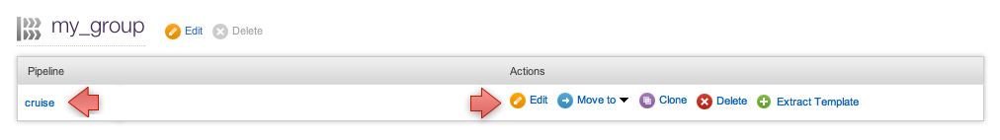

# Use a custom pipeline label

When using Go to build your application, it is often useful to be able to include extra information in the label Go uses. For example, you might want to have your label contain a static major.minor version number in addition to the unique count of the pipeline.

-   Click on the [Administration](../navigation/administration_page.html) tab

-   Edit the pipeline

-   Add the label template

-   Click save

You might also want to include material revision into the pipeline label so that it's easier to find a Go pipeline by material revision and vice versa. For example, you might have a pipeline with a svn material. The following example shows how to include svn material revision into pipeline label:

``` {.code}
<pipeline name="main" labeltemplate="1.3.${COUNT}-${svn}">
  <materials>
      <svn url="http://server/path" materialName="svn" />
  <materials>
  ...
</pipeline>
  
```

You can optionally truncate a material revision. This might quite handy in case of a Git material, for example.
By adding a "[:7]" you can have a short, truncated version of the Git revision hash that has exactly 7 characters.
(Please note a subtle difference between this truncated git revision and the "official git short revision".
The later one might be 4-7 characters long as Git tries to find a unique hash that's as short as possible. See the
[documentation of git-rev-parse](https://www.kernel.org/pub/software/scm/git/docs/git-rev-parse.html)
under "--short" for further details.)

``` {.code}
<pipeline name="main" labeltemplate="15.1.${COUNT}-${git[:7]}">
  <materials>
      <git url="git://github.com/foo.git"  materialName="git" />
  <materials>
  ...
</pipeline>

```

You can also include the revision of an upstream pipeline into the pipeline label to, for example, share the same revision across different but related pipelines:

``` {.code}
<pipeline name="upstream" labeltemplate="1.3.${COUNT}-${svn}">
  <materials>
      <svn url="http://server/path" materialName="svn" />
  <materials>
  ...
</pipeline>
<pipeline name="downstream" labeltemplate="${upstream}">
  <materials>
      <pipeline pipelineName="upstream" stageName="dev" materialName="upstream" />
  <materials>
  ...
</pipeline>
  
```

In this case, if the label of upstream pipeline is "1.3.0-1234", then when downstream pipeline is triggered, the label of downstream pipeline is also "1.3.0-1234".