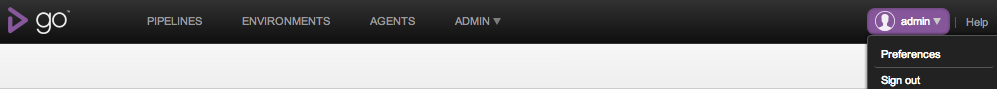
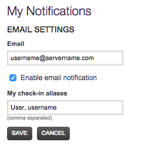
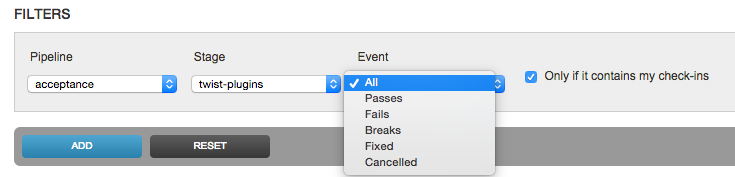
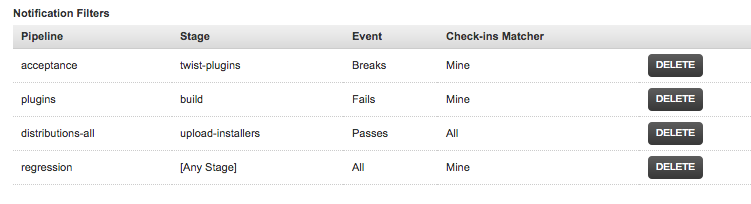

# Notifications

It is often useful to receive an email when certain status changes occur in a stage. For example, a developer might want to know when their own check-in has broken the build. Alternatively, a manager might want an email whenever a project is deployed into production. Both of these scenarios can be covered by Notification Filters

Notifications will only work if [Security](dev_authentication.md) is enabled and [mailhost information](admin_mailhost_info.md) is correct.

## Example usage

Usage: As a developer, I want to be notified when I break the build.

Click on the **Preferences** tab

Click "Edit" and enter my email address, and make sure "Enable email notification" is checked

When I check in, my source control log in will be either "ChrisT" or "CT", so enter both of those into the "My check-in aliases" box

Click "Save" to store these values

Add a filter for the first "dev" stage to notify me when a check-in of mine breaks the build

### Events

You can set up notifications for different events

-   All - all the runs for the stage
-   Passes - the passed runs for the stage
-   Fails - the stage runs that failed
-   Breaks - the stage run that broke the build
-   Fixed - the stage run that fixed the previous failure
-   Cancelled - the stage run that was cancelled

Illustration

-   Previous build Pass, current build Fail: Event: Break
-   Previous build Fail, current build Fail: Event: Fail
-   Previous build Fail, current build Pass: Event: Fixed
-   Previous build Pass, current build Pass: Event: Pass

I'll be emailed whenever the "twist" stage of "acceptance" pipeline breaks due to my check-in

I'll be emailed whenever the "auto-upgrade" stage of "auto-deploy-testing-ubuntu9.10" pipeline fails due to my check-in

I'll be emailed for all events for the "dev" stage of cruise pipeline