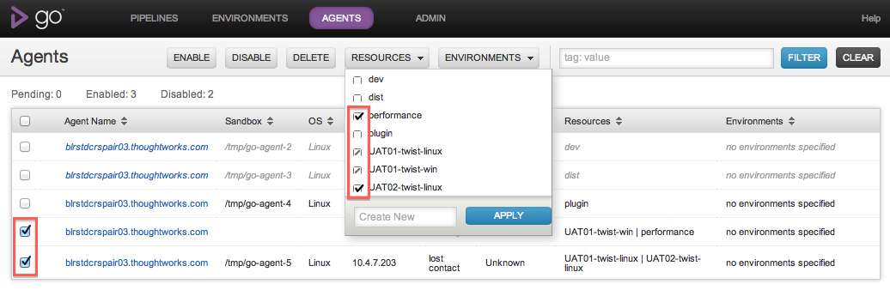
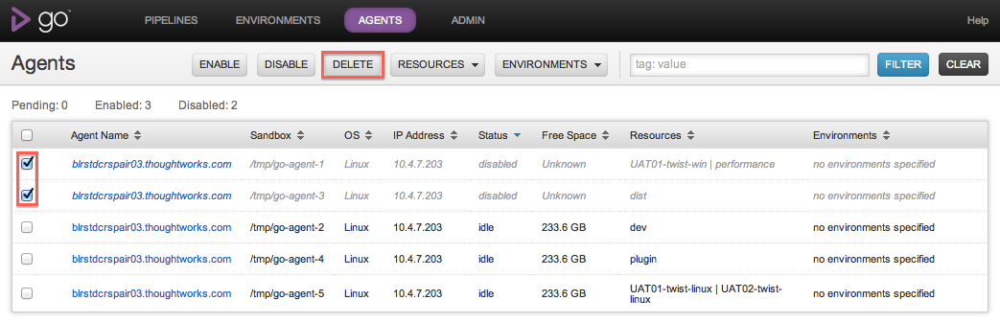
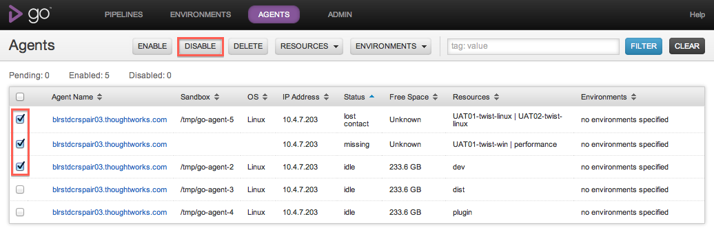

# Managing agents

Go is designed to make managing a build cloud extremely simple. This page takes you through the lifecycle of expanding your cloud and maintaining your agents.

## Adding a Go agent to your cloud

The first thing you need to do is [install Go agent](../installation/installing_go_agent.md) on the machine you want to add to the cloud.

Once the Go agent has been installed and pointed at your Go server, go to the [Agents](../navigation/agents_page.md) tab on the Go dashboard. You should see something like this:

Note that the hostname is as reported by the agent, and the IP address is as reported by the server.

To add the agent to the cloud, click "Enable". Note that even after you have clicked "Enable", the agent will not be enabled until it next contacts the server -- so if your agent has stopped talking to the server, nothing will happen.

Once your agent has successfully been enabled, it should no longer appear greyed out and will and be marked "idle". At this point your agent will automatically begin picking up jobs. Agents will automatically check out any code they need in order to start running jobs.

## Matching jobs to agents

In its default state, Go server will assign scheduled jobs to the first available agent. Go doesn't have the ability to determine what operating system or other resources are present on a given agent. If you want particular jobs to run on particular agents, you'll need to specify **resources** .

You can specify one or more resources that a particular job needs in order to execute. In the same way, you can specify that an agent has one or more resources. Go will then match jobs to agents, such that a job will only run on agents which have at least the resources required for that job.

Resources are just plain text tags. There are no preset tags or conventions around tagging -- just use what makes sense to you. You might, for example, use operating systems as tags: "RHEL linux", "Windows XP". You could also use browsers, databases, or whatever else makes sense. We recommend you let your classification be driven by your jobs -- if you know that certain jobs will only work on certain machines, tag the jobs with the special resource or resources that job needs in order to work, and then classify the agents accordingly.

> Note: Resource matching is case-insensitive.

To specify the resources that a job needs, go to the **Pipelines configuration** section of the [Administration](../navigation/administration_page.md) tab and edit the job that you want to specify resources for:

Once you’ve specified the resources your jobs need, you’ll want to describe the resources your agents have. You can do this very easily in the [Agents](../navigation/agents_page.md) tab. Just select the agents you want to describe, and click on the **Resources** button.

### Associate selected agent(s) with a newly created resource

Enter the name of the new resource and click the “Add” button.

### Associate selected agent(s) with existing resources

All existing resources across your agents and jobs will appear in alphabetical order. Select one of three states for all resources you want to associate and then click the “Apply” button.

-   A resource **with a check** will add the resource to all selected agents.
-   A resource **with a forward slash** means some of your selected agents are associated to it. No change will occur after clicking “Apply”.
-   A resource **without a check** will remove the resource from all selected agents.

## Agent states

Go will tell you if it loses touch with agents. If Go server doesn't hear from an agent for two minutes, the agent will turn red in the [Agents](../navigation/agents_page.md) tab, and Go will tell you the last time it heard from the agent. Go will also transparently re-assign the build to the next available agent that can run it, if the lost agent was building a job.

Go will also let you know if one of the agents it knows about has never contacted it since Go server was last started. In this case, the agent's state will be marked as "missing" and it will be gray.

If an agent is working on a job, it will turn orange, and display the name of the job it is working on. You can click on the job description to go to the job details page for that job:

## Removing agents

If you want to remove an agent from Go's build cloud, go to the agents tab, locate the agent you want to remove, and click on the button marked "Disable". Go will record in its configuration that this agent should be excluded from the build cloud. If you restart Go server, the agent will continue to be disabled. Disabled agents do not count towards Go's licensed agents.

To permanently remove an agent from Go's configuration, you can use the [agent api](http://api.go.cd/#agents) or delete from the agents tab. The agent must be disabled before it can be deleted

Following this procedure, if you restart the agent, Go server will see it as a new agent, and you can enable it again in the same way as described above.

## Pausing agents

If you want to pause an agent or temporarily disable it so that Go server will not assign work to the agent. Go will record in its configuration file that the agent has been disabled. This means, if you restart Go server, the disabled agent will remain disabled. You can use the following api to [disable agents](../api/agent_api.md) or you can disable the agent from the agents tab.

A disabled agent can be enabled; this will make it eligible to pick up work again. You can use the api or enable an agent from the agents tab.

## Details of a single agent

Go now provides a page that shows the details of a single agent. This page provides details about the agent configuration and the history of all the jobs that ran on that agent.

### Agent Details tab

This tab shows the configuration and runtime information of an agent. For example, this tab shows the free space available on the agent, the IP Adress and the OS of the agent.

In terms of configuration, this tab shows the resources of the agent and the environment it belongs to. A sample Details tab looks as below:

### Job Run History tab

You must be logged in as an admin user to configure this step.

This tab shows a table of all the completed jobs that ran on this agent. A sample page is shown below

For every job, the following columns are shown:

1.  Pipeline: The pipeline to which the job belongs to
2.  Stage: The stage to which the job belongs to
3.  Job: The name of the job
4.  Result: The result of the job - Passed, Failed, Cancelled or Rescheduled
5.  Completed: The date when the Job completed
6.  Duration: The duration that the Job took to finish - from scheduled till completed.

The job listing table can be sorted on any column, except for the Duration column.

### Using Agent details to debug agent issues

This page is useful to figure out if there are agent issues and hence a certain job keeps failing on that agent.

Consider a job which runs functional tests for a web application that need a browser to be available. The job was passing so far and only recently it has started to fail intermittently. Here are the steps you can follow to figure out if this is an agent issue.

1.  Navigate to the [Job Details page](../navigation/job_details_page.md) of the given job that failed.
2.  Locate the "Agent" label and click on the link to the agent
3.  Navigate to the "Job Run History" tab
4.  Sort on the Job Name and locate the job that just navigated from

You'd notice that the job started to fail recently. You can even see if there are other jobs that have started failing around the same time by now sorting on the Completed date.
