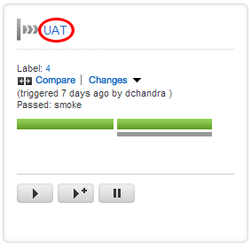

# What has changed in the current version?

When updating your testing environments to a new version, it is useful to know what changes have been made since it was last updated. Since there is currently no way to get this information in Go automatically, there are some extra steps we must take.

## Example usage

For this example, we'll assume that there is a manual "UAT" stage will automatically deploy and install an executable on your user acceptance testing machine.

-   On the [Pipelines](../navigation/Pipelines_Dashboard_page.md) page, click on the name of your pipeline

-   Now that you're on the [pipeline Activity](../navigation/pipeline_activity_page.md) page, you can see exactly how far each check-in has gotten in your pipeline
-   Find the check-in that's currently in UAT. In this example, it has the pipeline label of **2.0.0.5077**

-   For every check-in earlier than the one in UAT, click to see the comments