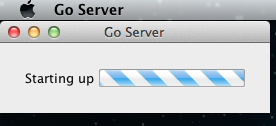

# Installing Go server on Mac OS X

<!-- toc -->

## Installation

1.  Double-click the downloaded file to unzip the contents.
2.  Drag the Go server Application to the Applications folder.
3.  Go server will store its data in ```~/Library/Application Support/Go Server``` subfolder of the user's home folder
4.  Double-click on the ```Go Server.app``` icon to open the launcher
5.  While the Go server is starting up, you'll see a progress bar in the top left of your screen

    

6.  Once the Go server has started, it will open your default browser to the Go dashboard page.
7.  To get back to the Go dashboard page when the server is running, click on the link in the About box of the Go server

## Override environment variables (Mac OSX installer)

You can override default environment variables by:

1. Overriding them during startup when starting from the terminal
    ```bash
    PATH=$PATH:/usr/local/bin open /Applications/Go\ Server.app
    ```

2. Overriding them using a file ```~/Library/Application Support/Go Server/overrides.env```. This file is sourced during server startup, and it can be setup to change environment variables.
    ```bash
    PATH=$PATH:/usr/local/bin
    ```

## Location of go server files

```bash
/Applications/Go Server.app             # The go agent application
~/Library/Application Support/Go Server # The agent directory
```

Some logging information is also written to ```/var/log/system.log```

!INCLUDE "_install_server_footer.md"
