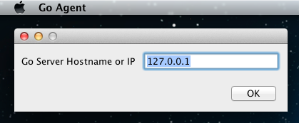

# Installing Go agent

## Introduction

You need to deploy at least one Go agent before you can build with Go. For the very simplest installation, you can run a Go agent on the same machine as your Go server.

## Installation

### Windows

> You must be logged in as a user with Admin privileges to install the Go agent on Windows.

1.  Double-click the go-agent-${version}.exe installer file and follow the prompts to install Go.
2.  During installation you will be asked to select a root path for your Go agent. In addition to holding your agent installation, this directory will contain the source code your agent checks out for every build.
3.  You will next be prompted to choose the bundled Oracle JRE 7 or specify the location of JRE (or JDK) installed on your system
4.  After installing the files, the installer will prompt you for the hostname or IP address of the Go server. If you leave this blank it will default to the local machine.
5.  At the end of the installation, Go agent registers itself as a windows service and starts running automatically.

#### Silent Installation

``` {.code}
< agent installer > /S /SERVERIP=< ip of go server > /GO_AGENT_JAVA_HOME=< path to JRE > /D=< directory where you want agent to be installed >
```

SERVERIP is optional. Default value is localhost (127.0.0.1)

GO\_AGENT\_JAVA\_HOME is optional. Default is the packaged JRE 7

Installation-Directory is optional. Default value is C:\\Program Files(x86)\\Go Agent

-   For example, C:\\\>go-agent-12.3.0-2000-setup.exe /S/SERVERIP=10.10.10.10 /D=C:\\go\\agent

> If User Access Control feature is enabled on your Windows system, it needs to be turned off for silent installation to work

> If you are using the silent installation to upgrade an agent, you should not specify the Installation-Directory option.

#### Override default startup arguments


-   Create a file named *wrapper-properties.conf* inside the *config* directory
-   With reference to the representation above, if you wish to override *wrapper.java.additional.2*,
    1.  Copy the property from *wrapper-agent.conf* to *wrapper-properties.conf*
    2.  Change the value associated to *wrapper.java.additional.2* to the desired value
-   Adding a new property entails:
    1.  Increment the **x** by 1 in *wrapper.java.additional.x* where **x** is the highest number in *wrapper-agent.conf* and *wrapper-properties.conf* combined
    2.  Add this newly created property to the *wrapper-properties.conf*

### Mac OSX

1.  Double-click the downloaded file to unzip the contents.
2.  Drag the Go Agent.app icon to the Applications folder.
3.  Double-click on the Go Agent.app icon to open the launcher.
4.  The very first time you run the Go agent on your machine you will be prompted for the hostname or IP address of your Go server. By default it will try connecting to the local machine. Click the OK button to continue.

    

### Linux

> You must be logged in as root, or use *sudo*, to install Go on Linux. Go agent also requires that the Oracle or Open JRE or JDK - version 6 or above - is installed.

> The installer will create a user called *go* if one does not exist on the machine. The home directory will be set to */var/go*. If you want to create your own *go* user, make sure you do it before you install the Go agent.

#### RPM based distributions (ie RedHat)

> The Go agent RPM installer has been tested on RedHat Enterprise Linux and CentOS. It should work on most RPM based Linux distributions.

- Run *rpm -i go-agent-${version}.noarch.rpm* to install Go agent.

#### Debian based distributions (ie Ubuntu)

> The Go agent .deb installer has been tested on Ubuntu. However it should work on most Linux distributions which use debs.

- Run *dpkg -i go-agent-${version}.deb* to install Go agent.

The following command could be used after installation:

-   Check Go agents' status with command *sudo /etc/init.d/go-agent status*
-   Start Go agents with command *sudo /etc/init.d/go-agent start*
-   Stop Go agents with command *sudo /etc/init.d/go-agent stop*

Once the package has been installed you need to configure the hostname or IP address of your Go server and start the agent. To do this, do the
following:

1.  Open */etc/default/go-agent* in your favourite text editor.
2.  Change the line *GO\_SERVER=127.0.0.1* to list the hostname or IP address of your Go server.
3.  Save the file and exit your editor.
4.  Run */etc/init.d/go-agent start* to start the agent.

#### Solaris

> You must be logged in as root, or use *sudo* or *pfexec*, to install Go on Solaris. Go agent also requires that Oracle or Open JRE or JDK - version 6 or above - is installed.

> The installer will create a user called *go* if one does not exist on the machine. The home directory will be set to */var/go*. If you want to create your own *go* user, make sure you do it before you install the Go agent.

1.  Uncompress the package with the command *gzip -d go-agent-\${version}-solaris.gz*
2.  Install the package with the command *pkgadd -d go-agent-\${version}-solaris*
3.  By default the agent will try connecting to localhost as the server.
    To change this, perform the following steps:
    - Open */etc/default/go-agent* in your favourite text editor.
    - Change the line *GO\_SERVER=127.0.0.1* to list the hostname or IP address of your Go server.
    - Save the file and exit your editor.
    - Run */etc/init.d/go-agent start* to start the agent.


The following command could be used after installation:

-   Check Go agents' status with command *svcs go/agent*
-   Start Go agents with command *svcadm enable -s go/agent*
-   Stop Go agents with command *svcadm disable -s go/agent*

## Location of files after installing Go agent

### Windows

All the files for the Go agent are under its root installation folder in Windows, the default location is C:\\Program Files\\Go Agent.

### Linux

``` {.code}
/var/lib/go-agent      #contains the binaries
/usr/share/go-agent    #contains the start script
/var/log/go-agent      #contains the agent logs
/etc/default/go-agent  #contains all the environment variables with default values. These variable values can be changed as per requirement
```

### Mac OSX

``` {.code}
/Applications/Go Agent.app
<user-home>/Library/Preferences/com.thoughtworks.studios.cruise.agent.properties
<user-home>/Library/Application Support/Go Agent
```

Some logging information is also written to /var/log/system.log

### Solaris

``` {.code}
/var/lib/go-agent    #contains the binaries
/usr/share/go-agent  #contains the start script
/var/log/go-agent    #contains the server logs
```

## Registering your agent with the server

For security reasons, all newly installed Go agents need to be enabled on the Go server before work is assigned to them. This prevents an unauthorized person from getting access to your source code. To enable a newly installed Go agent, do the following:

1.  Open the Go server dashboard
2.  Follow the instructions [here](../configuration/managing_a_build_cloud.md) to find the agent you've just installed on the list and add the agent to your cloud. The Go server will now schedule work for this agent.
