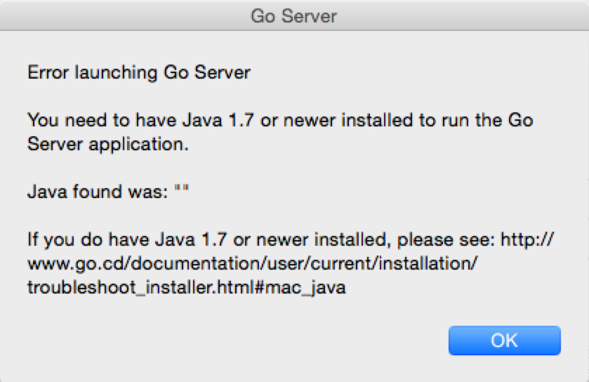

# Troubleshooting installation issues

<a name="mac_java"></a>
## Mac OS X

### Message related to Java 1.7

If you were greeted with a message such as this, when trying to use Go on Mac OS
X:

<figure class="small_image">
  
</figure>

you might have a Java installation in either a non-standard location or older
than Java 1.7. The Go Mac application tries to find the correct Java
installation to use, using this command:

```
/usr/libexec/java_home -v "1.7+"
```

If that fails, then you see the message shown above.

In case you are sure that you have Java 1.7 or newer installed, and the
application cannot find it at all, then the application can be forced to use a
Java installation of your choosing, using the ```GO_JAVA_HOME``` environment
variable. Suppose the ```Go Server.app``` file is in /Applications, and the Java
installation you want Go to use is at: ```/Library/MY_Java/Contents/Home```,
then you can start the Go Server with that Java using this (in a terminal
emulator):

```
GO_JAVA_HOME="/Library/MY_Java/Contents/Home" open "/Applications/Go Server.app"
```

Please note that this is used to set the Java home, and not the path to the
```java``` executable. Usually, GO_JAVA_HOME/bin/java will need to be a working
Java 1.7+ executable.

<style type="text/css">
  figure.small_image img { width: 50%; margin-left: 25%; }
</style>
