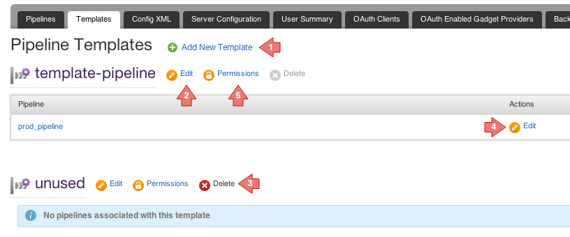

# Administration

There are four ways to configure pipelines etc

1.  Via the admin UI described below
2.  Direct XML edit via the admin UI's Config XML tab
3.  Some limited configuration is possible via [config API](../api/configuration_api.md)
4.  Direct XML edit via the file system. By default, Go server polls the filesystem every 5 seconds for changes to cruise-config.xml. The location of this file is indicated in the top right corner of the Admin \> Config XML tab.

## Pipelines

The "Pipelines" tab allows you to configure pipelines grouped in pipeline groups.

### Key

1.  Add a new pipeline group
2.  Edit the pipeline group name and permissions.
3.  Delete an empty pipeline group.
4.  Create a pipeline within a pipeline group
5.  Click the pipeline name to select a pipeline to view or edit.
6.  Click to view/edit a pipeline
7.  Move pipeline to another pipeline group.
8.  Delete a pipeline

## Pipeline Templates

The "Templates" tab allows you to configure pipeline templates which can be used to templatize pipelines.

### Key

1.  Add a new pipeline template
2.  Edit the pipeline template.
3.  Delete an unused pipeline template.
4.  Edit a pipeline using this pipeline template.
5.  As a Go Administrator, you can now edit permissions for the template to make users [Template Administrators](../configuration/dev_authorization.md#template-admin).