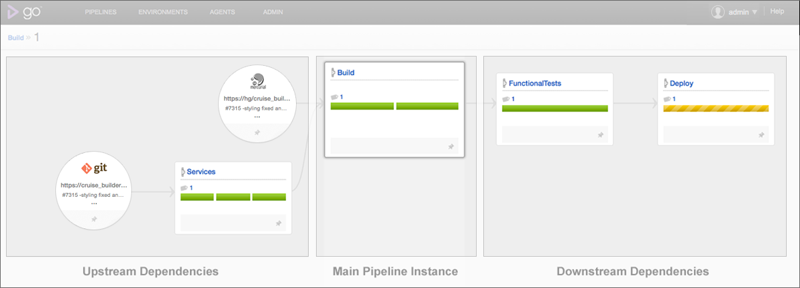
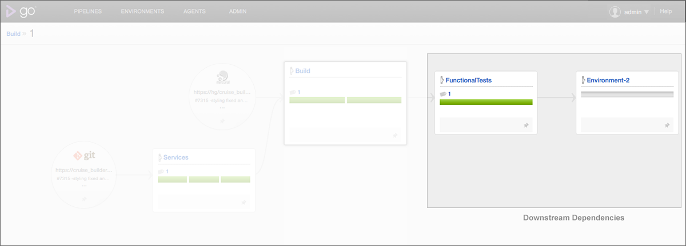
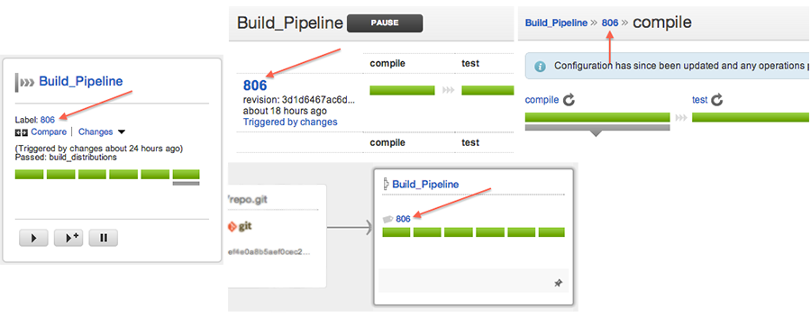
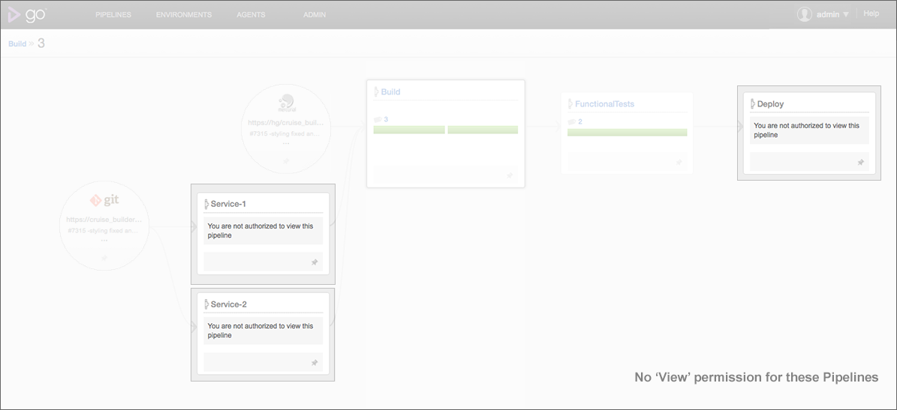

# Value Stream Map

## Introduction

Value Stream Map helps you visualize your CI/CD workflow. With a single click, it allows you to trace a commit from when it is checked in up to when it is deployed.

A value stream map can be drawn for every instance of a pipeline. It provides you with the ability to:

-   See what caused the current pipeline to be triggered.
-   See what downstream pipelines were triggered by the current pipeline.
-   See the status of the current pipeline and all its upstream and downstream dependencies.
-   See changes in dependencies of the pipeline across different runs of it.

Along with all this, it also allows you to easily debug problems when a dependency/configuration change caused your build-test-release setup to break.

## Understanding the Value Stream Map

The Value Stream Map is laid out as an end-to-end dependency graph. The graph originates from source control materials and flows from left to right.

The pipeline instance for which the Value Stream Map is being viewed is the main pipeline and is highlighted. Everything to the left of this pipeline are its upstream dependencies, ie all the materials that have contributed to this instance. Everything to the right are its downstream dependencies, ie, all the pipelines that it can potentially trigger or contribute to.

### Upstream Dependencies

The upstream dependencies of the main pipeline are taken from history and show all the source control and pipeline dependency materials that have contributed to the main pipeline. Even when the Go Configuration changes after a certain instance of a pipeline, its upstream dependency graph will continue to reflect the older configuration with which it was run. This also means that it would display pipelines that do not exist in the configuration any more.

Let us assume that instance '1' of pipeline 'Build' is as below

If the configuration changes to replace the pipeline 'Services' with 2 pipelines - 'Service-1' and 'Service-2', the next instance of pipeline 'Build' would reflect the change.

Value Stream Map of pipeline 'Build' with counter '1' would look as below

### Downstream Dependencies

The downstream dependencies of the main pipeline instance indicate what can happen with it. This information is always taken from the latest configuration. Pipelines that have not run yet are also shown

If Environment-1 is removed from the configuration, the Value Stream Map for the same instance of 'Build' would look as below.

### Multiple Pipeline Instances

A pipeline could be re-triggered multiple times with the same revision. In such cases, all the instances are shown in descending order against that pipeline. In the below example, 'Deploy' has been triggered thrice with counter '2' of pipeline 'FunctionalTests'.

### Viewing the Value Stream Map

Every pipeline label in Go directs you to the value stream map of that instance of the pipeline.

### Permissions

The permissions required to view a value stream map are as follows:

-   Go Administrators have access to the value stream maps of all the pipelines that are configured.
-   Users with view permissions for a pipeline will be able to view the value stream map for all instances of that pipeline.

However, there is one special case to be noted where the pipeline details might not be shown completely. If the user does not have view permissions for a pipeline in the Value Stream Map, its details, like the stages and instances run will not be shown.

If you are using Internet Explorer as your browser please note that Value Stream Map is supported with only versions 9 and above.