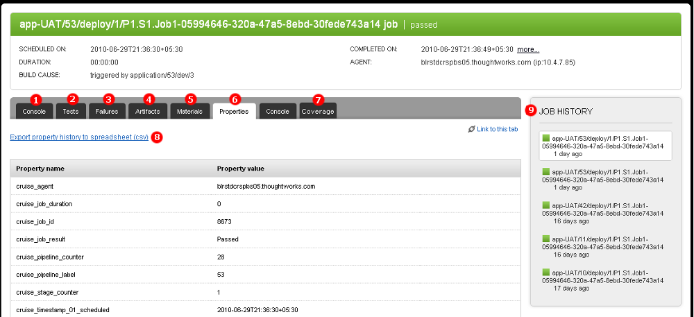

# Job Details

The Job Details page shows the details of a job within a specific stage.

### Key

1.  The "Console" Tab shows the console output of the agent running the job in near-real time.
2.  The "Tests" Tab shows junit compliant test output. (After you [upload test reports](../configuration/dev_upload_test_report.md))
3.  The "Failures" Tab shows any test, server, compilation, or network error associated with a failed job run.
4.  The "Artifacts" Tab shows a collapsible list of the job's artifacts.
5.  The "Materials" Tab shows what activated the pipeline through a list of comments and revisions.
6.  The "Properties" Tab shows the list of [properties](../advanced_usage/properties.md) for the job. Some properties are Go defaults. You can also automatically [save custom properties](../faq/dev_save_properties.md).
7.  The "Coverage" Tab is an example of a custom tab. You can create [custom tabs](../faq/dev_see_artifact_as_tab.md) to view any uploaded artifact.
8.  Click "Export property history to spreadsheet (csv)" to view a job's property values over time in an excel compatible format. This is useful for charting and graphing various build metrics.
9.  The Jobs History sidebar lists recent jobs by date and time. Each job is highlighted with a passed, failed, or canceled icon. Click the job to view its Job Details information.

### Also See...

-   [Re-running job(s)](../faq/job_rerun.md)